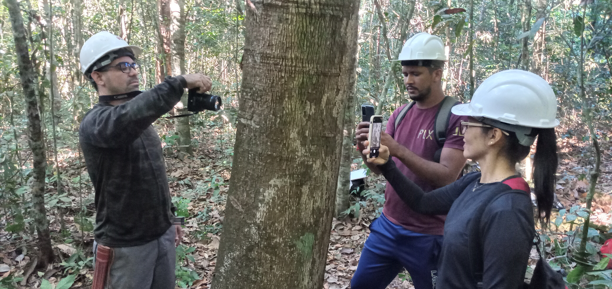

<!-- README.md is generated from README.Rmd.. Please edit that file.. -->

<!-- badges: start -->

<!-- badges: end -->

<!-- Emprestei a função list_github_files() da Curso-R. (https://github.com/curso-r). A ideia desse readme emprestei da Curso-R. Achei excelente!-->

# Olá, seja bem vindo(a)! :deciduous_tree: :smiley: :grin: :deciduous_tree:

:calendar: **08 de Setembro de 2025**

:alarm_clock: **15h30min - 17h00min**

<a itemprop="sameAs" content="https://orcid.org/0000-0002-2975-0927" href="https://orcid.org/0000-0002-2975-0927" target="orcid.widget" rel="me noopener noreferrer" style="vertical-align:top;">https://orcid.org/0000-0002-2975-0927</a>

**Lattes**: <http://lattes.cnpq.br/9063094443073532>

**Researchgate**: <https://www.researchgate.net/profile/Deivison-Souza>

------------------------------------------------------------------------

# Descrição

Este repositório guarda os arquivos .Rmd e .R usados na palestra
intitulada **“Redes Neurais Convolucionais (RNCs): Reconhecendo Espécies
de Plantas a partir de Imagens”** ministrada pelo **Prof. Dr. Deivison
Venicio Souza** para discentes de graduação em Engenharia Florestal e do
Programa de Pós-Graduação em Engenharia Florestal da Universidade
Federal do Paraná (UFPR) a convite da **Profa. Ana Paula Dalla Corte**.

# Slide da palestra

O slide da palestra síncrona intitulada **“Redes Neurais Convolucionais
(RNCs): Reconhecendo Espécies de Plantas a partir de Imagens”** está
disponível a seguir.

| Slide | Link |
|:------|:-----|

# Facilitador :deciduous_tree:

 

Graduado em :deciduous_tree:**Engenharia Florestal** (ano 2008) e
**Mestrado em Ciências Florestais** (ano 2011) pela **Universidade
Federal Rural da Amazônia - UFRA** e **Doutorado em Engenharia
Florestal** pela **Universidade Federal do Paraná - UFPR** (ano 2020).
Também possui **Especialização em Data Science e Big Data pela UFPR**
(ano 2019). Atualmente, é docente Associado I na Universidade Federal do
Pará (UFPA), atuando no curso de Graduação em Engenharia Florestal,
Programa de Pós-Graduação em Biodiversidade e Conservação (PPGBC), e no
Programa de Pós-Graduação em Ciência, Tecnologia e Inovação Florestal
(PPGCTIF) da Universidade Federal do Oeste do Pará (UFOPA). É
responsável por ministrar as disciplinas de Estatística Básica,
Dendrometria, Experimentação Florestal e Inventário Florestal no Curso
de Graduação em Engenharia Florestal da UFPA, e a disciplina de
Estatística Computacional no PPGBC. Coordena projetos de pesquisas
orientados ao manejo e conservação da biodiversidade, com ênfase no
desenvolvimento de tecnologias baseadas em inteligência artificial e
visão computacional para o reconhecimento automático de espécies da
flora Amazônica. Também tem contribuído em projetos socioambientais
junto aos povos originários, em parceria com a Associação Indígena
Pyjahyry Xipaya - AIPHX, com ênfase na estruturação e fortalecimento de
cadeias de produtos da sociobiodiversidade e gestão territorial e
ambiental.

