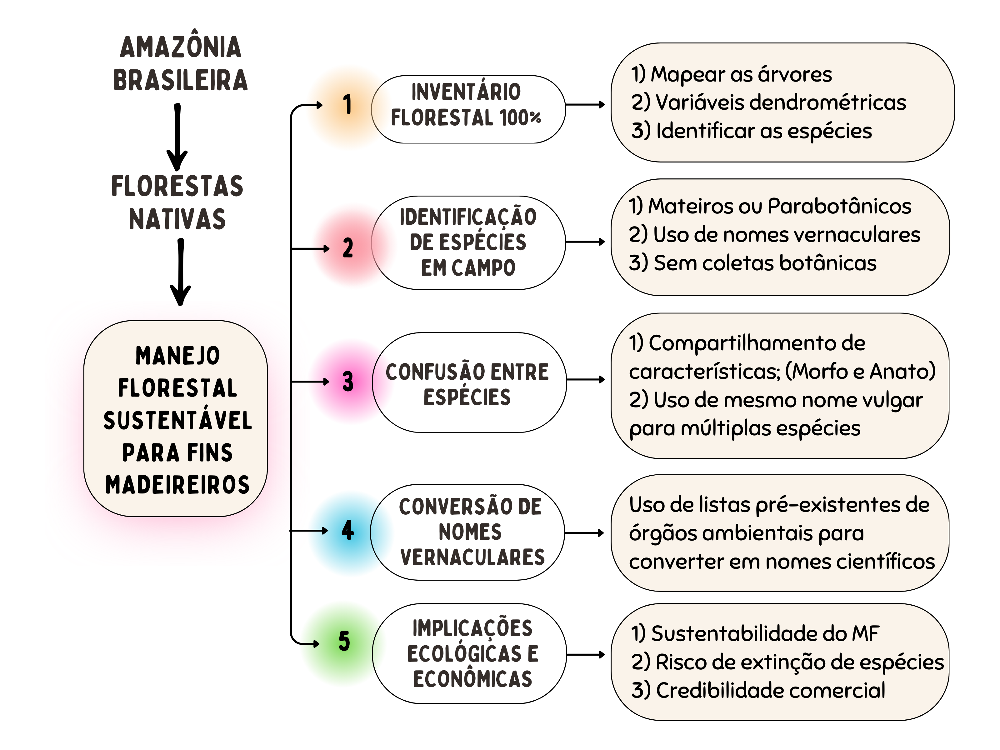
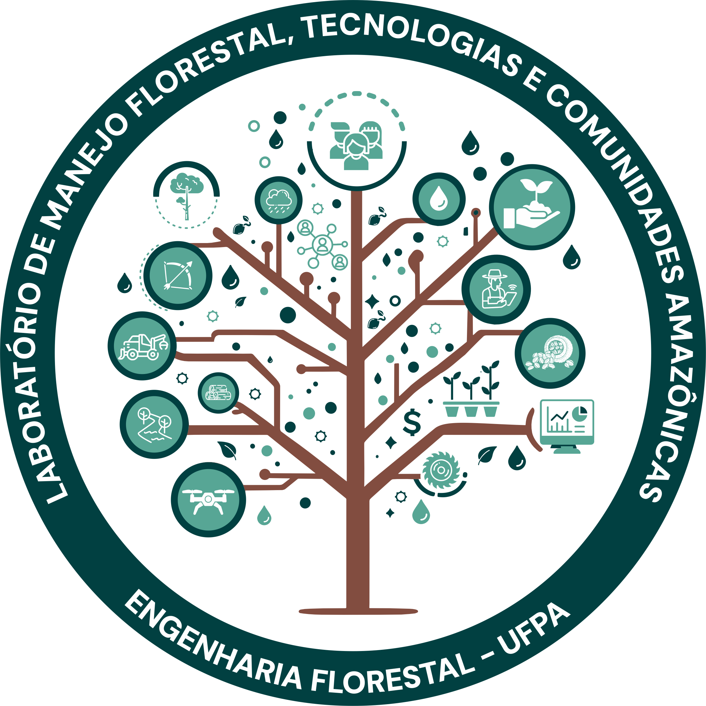

class: title-slide, center, middle
background-image: url(fig/LMFTCA.png), url(fig/ufpa.png), url(fig/PPGBC.png), url(fig/PPGCTIF.PNG), url(fig/title.jpg)
background-position: 90% 5%, 10% 5%, 10% 90%, 90% 90%
background-size: 130px, 110px, 150px, 130px, cover

```{r setup, include=FALSE}
knitr::opts_chunk$set(
  fig.showtext = TRUE,
  fig.align = "center", 
  cache = TRUE,
  error = FALSE,
  message = FALSE, 
  warning = FALSE, 
  collapse = TRUE ,
  dpi = 600)
```

```{r icon, echo=FALSE}
#remotes::install_github("mitchelloharawild/icons")
#library(icons)
#download_fontawesome()
#download_simple_icons()
```

```{r packages, include=FALSE}
# remotes::install_github("dill/emoGG")
library(ggplot2)
library(dplyr)
library(ggimage)
```


<!-- title-slide -->
<br>
##### Universidade Federal do Pará (UFPA)
##### Faculdade de Engenharia Florestal
##### Laboratório de Manejo Florestal, Tecnologias e Comunidades Amazônicas
##### Programa de Pós-Graduação em Biodiversidade e Conservação (PPGBC)/UFPA
##### Programa de Pós-Graduação em Ciência, Tecnologia e Inovação Florestal (PPGCTIF)/UFOPA

## Redes Neurais Convolucionais (RNCs): Reconhecendo Espécies de Plantas Usando Recursos de Imagens
### (*Convolutional Neural Networks (CNNs): Recognizing Plant Species Using Image Features*)
<br>
`r anicon::faa("pagelines", animate="horizontal", colour="green", size = 2)`
`r anicon::faa("tree", animate="float", colour="green", size = 2)`
<br>
##### 〰〰〰〰〰〰〰〰〰🌳〰〰〰〰〰〰〰〰〰
##### .font120[**Deivison Venicio Souza**]
##### Professor Associado I - UFPA
##### E-mail: deivisonvs@ufpa.br
##### 👨🏻‍👩🏻‍👦🏻‍👦🏻 [@lmftca_ufpa](https://www.instagram.com/lmftca_ufpa/)
##### 🌎 [https://www.lmftca.com.br/](https://www.lmftca.com.br/)
<br>
##### 1ª versão: 08/setembro/2025 <br> (Atualizado em: `r format(Sys.Date(),"%d/%B/%Y")`) <br> Altamira, Pará

---
layout: true
background-image:  url(fig/LMFTCA.png), url(fig/cont.png)
background-position: 99% 94%
background-size: 100px, cover

---
## 📙 Conteúdo

.pull-left-4[
.pull-top[
👉 **Parte 1 - Conceitos e fundamentação teórica**
.font80[

[1 - Motivação](#mot)

[2 - Inteligência Artificial, Aprendizado de Máquina e Aprendizado Profundo](#ia)

[3 - Redes Neurais Convolucionais (RNC)](#ia)

&nbsp;&nbsp;[3.1 - O que são?](#TA)

&nbsp;&nbsp;[3.2 - Arquitetura](#TA)

&nbsp;&nbsp;[3.3 - Redes Neurais Convolucionais Pré-Treinadas](#TA)

&nbsp;&nbsp;[3.4 -Bibliotecas (keras, Tensorflow)](#TA)

[3 - Métodos de Reamostragem](#rea) 

[4 - Medidas de Desempenho](#des)

]
]
]

--

.pull-right-4[
👉 **Parte 2 - Aplicações no reconhecimento de Espécies da Flora**
.font80[
[1 - Método de Bitterlich](#mb)

[2 - Método da Linha Interceptadora](#mli)

[3 - Método de Strand](#ms)

[4 - Método de Prodan](#mp)

]
]

---

## 📙 Conteúdo
<br>
.pull-left-4[
.pull-top[
👉 **Parte 3 - Projeto DeepFlora - **
.font80[

[1 - Motivação](#mot)


]
]
]

<!-- Slide XX -->
---
class: inverse
layout: false
background-image: url(fig/sec.png)
background-size: cover


## **Redes Neurais Convolucionais**
### (Conceitos e fundamentação teórica)

---
layout: true
background-image:  url(fig/LMFTCA.png), url(fig/cont.png)
background-position: 99% 94%
background-size: 100px, cover
---


<!-- Slide XX -->
---
class: inverse
layout: false
background-image: url(fig/deepflora.png), url(fig/sec.png)
background-position: 99% 90%
background-size: 350px, cover


## .font90[**Projeto DeepFlora: <br> Inteligência Artificial para Reconhecer <br> Árvores da Amazônia**]
### *(DeepFlora: Artificial Intelligence to Recognize Amazonian Trees)*

---
layout: true
background-image: url(fig/deepflora.png), url(fig/cont.png)
background-position: 99% 90%
background-size: 400px, cover
---
## 🖥️Projeto DeepFlora

.shadow1[
#### 🔍 **Projeto de Pesquisa, Desenvolvimento e Inovação Florestal**

👉 Desenvolver um **sistema de reconhecimento automático de espécies florestais** de valor comercial madeireiro, usando **imagens digitais de partes de árvores** (cascas externa (ritidoma), alburno e forma da base de troncos) e técnicas de **aprendizado profundo** (*Deep Learning*), visando a **melhoria da acurácia na identificação de espécies** da flora Amazônica no âmbito Manejo Florestal Sustentável para fins madeireiros.

]

---
## 🏫 Instituições Parceiras

```{r, echo=FALSE, out.width='20%', fig.align='center', fig.cap='', dpi=600}
knitr::include_graphics('fig/ufpa.png')
knitr::include_graphics('fig/UFPR.png')

knitr::include_graphics('fig/UFRRJ.png')
```

---
## 💰 Financiador

---
## 🤔 Motivação

.pull-left-3[
```{r, echo=FALSE, out.width='85%', fig.align='center', fig.cap='', dpi=600}

```
]

---
## 🌎 Áreas de Coletas

.shadow1[
#### 🔍 **Áreas de Manejo Florestal (AMFs)**

👉  3 AMFs para fins madeireiro no Estado do Mato Grosso:

1 - Fazenda Pérola (Nova Maringá)

2 - Fazenda Boa Esperança (Feliz Natal)

3 - Fazenda São Nicolau (Cotriguaçu)
]

---
## 📷 Conjunto de Imagens


---
## 🌳 DeepBark - Aplicação Web

.shadow1[
#### **DeepBark - IA para Reconhecer Árvores a partir de Imagens de Casca**

- É uma **Aplicação Web** para reconhecer **16 espécies** da flora Amazônica de valor comercial madeireiro, baseado em **imagens digitais de cascas externas** (Ritidoma).

Sobre o modelo:
Quais espécies


]

---
## 📖 Referências

<br><br>
CAMPOS, J. C. C.; LEITE, H. G. **Mensuração florestal: perguntas e respostas**. 3ª ed. - Viçosa, MG: Ed. UFV, 2009. 548 p.

---

layout: false
name: etim
class: inverse, middle, center
background-image: url(fig/title.jpg)
background-size: cover

## .font200[Obrigado!]

```{r, echo=FALSE, out.width='20%', fig.align='center', fig.cap='', dpi=600}

```

👨🏻‍👩🏻‍👦🏻‍👦🏻 [@lmftca_ufpa](https://www.instagram.com/lmftca_ufpa/)

🌎 [https://www.lmftca.com.br/](https://www.lmftca.com.br/)


