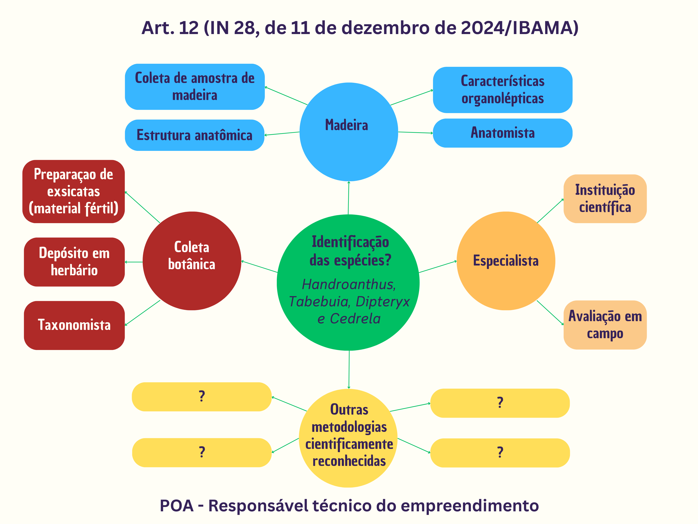
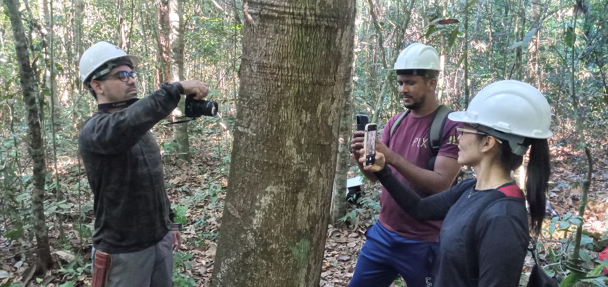
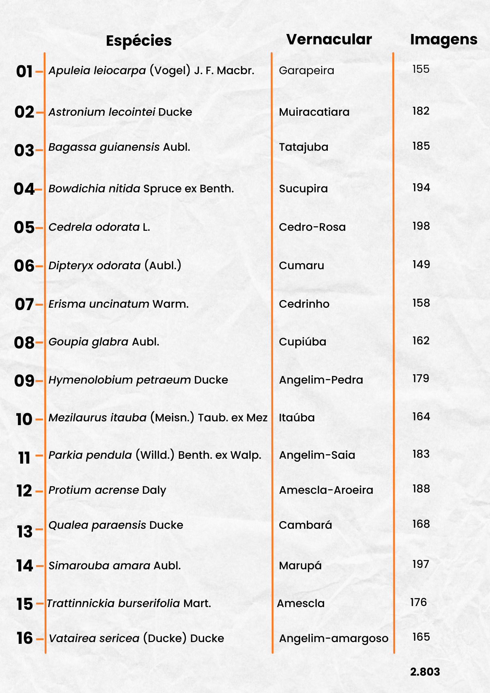

class: title-slide, center, middle
background-image: url(fig/LMFTCA.png), url(fig/ufpa.png), url(fig/PPGBC.png), url(fig/PPGCTIF.PNG), url(fig/title.jpg)
background-position: 90% 5%, 10% 5%, 10% 90%, 90% 90%
background-size: 130px, 110px, 150px, 130px, cover

```{r setup, include=FALSE}
knitr::opts_chunk$set(
  fig.showtext = TRUE,
  fig.align = "center", 
  fig.show='hold',
  cache = TRUE,
  error = FALSE,
  message = FALSE, 
  warning = FALSE, 
  collapse = TRUE ,
  dpi = 600)
```

```{r icon, echo=FALSE}
#remotes::install_github("mitchelloharawild/icons")
#library(icons)
#download_fontawesome()
#download_simple_icons()
```

```{r packages, include=FALSE}
# remotes::install_github("dill/emoGG")
library(ggplot2)
library(dplyr)
library(ggimage)
```


<!-- title-slide -->
<br>
##### Universidade Federal do Pará (UFPA)
##### Faculdade de Engenharia Florestal
##### Laboratório de Manejo Florestal, Tecnologias e Comunidades Amazônicas
##### Programa de Pós-Graduação em Biodiversidade e Conservação (PPGBC)/UFPA
##### Programa de Pós-Graduação em Ciência, Tecnologia e Inovação Florestal (PPGCTIF)/UFOPA

## Reconhecendo Espécies de Plantas Usando Redes Neurais Convolucionais (RNCs)
### *Recognizing Plant Species Using Convolutional Neural Networks (CNNs)*
<br>
`r anicon::faa("pagelines", animate="horizontal", colour="green", size = 2)`
`r anicon::faa("tree", animate="float", colour="green", size = 2)`
<br>
##### 〰〰〰〰〰〰〰〰〰🌳〰〰〰〰〰〰〰〰〰
##### .font120[**Deivison Venicio Souza**]
##### Professor Associado I - UFPA
##### E-mail: deivisonvs@ufpa.br
##### 👨🏻‍👩🏻‍👦🏻‍👦🏻 [@lmftca_ufpa](https://www.instagram.com/lmftca_ufpa/)
##### 🌎 [https://www.lmftca.com.br/](https://www.lmftca.com.br/)
<br>
##### 1ª versão: 08/setembro/2025 <br> (Atualizado em: `r format(Sys.Date(),"%d/%B/%Y")`) <br> Altamira, Pará

---
layout: true
background-image:  url(fig/LMFTCA.png), url(fig/cont.png)
background-position: 99% 94%
background-size: 100px, cover

---
## 📙 Conteúdo

.pull-left-4[
.pull-top[
👉 **Parte 1 - Conceitos e fundamentação teórica**
.font80[

[1 - Motivação](#mot)

[2 - Inteligência Artificial, Aprendizado de Máquina e Aprendizado Profundo](#ia)

[3 - Redes Neurais Convolucionais (RNC)](#ia)

&nbsp;&nbsp;[3.1 - O que são?](#TA)

&nbsp;&nbsp;[3.2 - Arquitetura](#TA)

&nbsp;&nbsp;[3.3 - Redes Neurais Convolucionais Pré-Treinadas](#TA)

&nbsp;&nbsp;[3.4 -Bibliotecas (keras, Tensorflow)](#TA)

[3 - Métodos de Reamostragem](#rea) 

[4 - Medidas de Desempenho](#des)

]
]
]

--

.pull-right-4[
👉 **Parte 2 - Aplicações no reconhecimento de Espécies da Flora**
.font80[
[1 - Método de Bitterlich](#mb)

[2 - Método da Linha Interceptadora](#mli)

[3 - Método de Strand](#ms)

[4 - Método de Prodan](#mp)

]
]

---

## 📙 Conteúdo
<br>
.pull-left-4[
.pull-top[
👉 **Parte 3 - Projeto DeepFlora - **
.font80[

[1 - Motivação](#mot)


]
]
]

<!-- Slide XX -->
---
class: inverse
layout: false
background-image: url(fig/sec.png)
background-size: cover


## **Redes Neurais Convolucionais**
### (Conceitos e fundamentação teórica)

---
layout: true
background-image:  url(fig/LMFTCA.png), url(fig/cont.png)
background-position: 99% 94%
background-size: 100px, cover
---


<!-- Slide XX -->
---
class: inverse
layout: false
background-image: url(fig/deepflora.png), url(fig/sec.png)
background-position: 99% 90%
background-size: 350px, cover


## .font90[**Projeto DeepFlora: <br> Inteligência Artificial para Reconhecer <br> Árvores da Amazônia**]
### *(DeepFlora: Artificial Intelligence to Recognize Amazonian Trees)*

---
layout: true
background-image: url(fig/deepflora.png), url(fig/cont.png)
background-position: 99% 99%
background-size: 400px, cover
---
## 🖥️Projeto DeepFlora

.shadow1[
#### 🔍 **Projeto de Pesquisa, Desenvolvimento e Inovação Florestal**

👉 **Objetivo**: Desenvolver um **sistema de reconhecimento automático de espécies florestais** de valor comercial madeireiro, usando **imagens digitais de partes de árvores** (cascas externa (ritidoma), alburno e forma da base de troncos) e técnicas de **aprendizado profundo** (*Deep Learning*), visando a **melhoria da acurácia na identificação de espécies** da flora Amazônica no âmbito Manejo Florestal Sustentável para fins madeireiros.

]

---
## 🤔 Motivação

.pull-left-3[
```{r, echo=FALSE, out.width='85%', fig.align='center', fig.cap=''}
knitr::include_graphics('fig/mot.png')
```
]

.pull-right-3[
<br><br>
.brand-red[.center[**Por que desenvolver um sistema de reconhecimento automático de espécies da flora?**]]
]

---
## 🤔 Motivação

.shadow1[
👉 **Instrução Normativa 28, de 11 de dezembro de 2024/IBAMA**
.font80[
Estabelece os procedimentos relativos às atividades de **Manejo Florestal Sustentável das espécies** listadas no **Anexo II** da Convenção sobre o Comércio Internacional das Espécies da Flora e Fauna Selvagens em Perigo de Extinção - **CITES**, dos gêneros .blue[*Handroanthus, Tabebuia, Dipteryx e Cedrela*], por recomendação do Parecer de Extração Não Prejudicial; e as regras de transição para autorização de exportação de produtos e subprodutos madeireiros desses gêneros oriundos de florestas nativas do bioma amazônico.
]
]

<br>

.pull-left-4[
.font80[
| Gênero         | FOA/FE/S/C |     | FOD |     |
|--------------  |------------|-----|-----|-----|
|                | DMC        | IME | DMC | IME |
| *Handroanthus* | 60         | 70  | 70  | 70  |
| *Tabebuia*     | 60         | 70  | 70  | 70  |
| *Dipteryx*     | 60         | 75  | 80  | 75  |
| *Cedrela*      | 55         | 70  | 70  | 50  |
]
]

.pull-right-4[
.font80[
FOA = Floresta Ombrófila Aberta/FE = Floresta Estacional/S = Savana/C = Campinarana

FOD = Floresta Ombrófila Densa

DMC = Diâmetro Mínimo de Corte, em cm

IME = Intensidade Máxima de Exploração, em %
]
]


---
## 🤔 Motivação

.pull-left-3[
```{r, echo=FALSE, out.width='85%', fig.align='center', fig.cap=''}

```
]

.pull-right-3[
<br><br>
.center[**Art. 12.** A identificação das espécies descritas deverá ser realizada no âmbito do POA, utilizando uma das metodologias a seguir:]
]

---
## 🎯 Erros na identificação de árvores


.pull-right-3[
<br><br><br>
.brand-red[.center[**Altas taxas de erros de identificação de espécies em PMFS na Amazônia...**]]
]

.pull-left-3[
- Lacerda e Nimmo (2010): 43,5% (132 espécies) das espécies identificadas por descrição botânica, não constavam na identificação
realizada no censo florestal (Em campo). Comparar nomes vernaculares com nomes científicos provou ser severamente deficiente.
]

---
.pull-left-11[
## 🏫 Instituições Parceiras
.pull-left-11[
```{r ufpa, echo=FALSE, fig.show='hold', out.width='70%', fig.align='center'}
knitr::include_graphics('fig/ufpa.png')
```
]

.pull-right-11[
```{r ufrrj, echo=FALSE, fig.show='hold', out.width='70%', fig.align='center'}
knitr::include_graphics('fig/UFRRJ.png')
```
]

.pull-bottom[
.pull-left-11[
<br><br>
```{r ufpr, echo=FALSE, fig.show='hold', out.width='80%', fig.align='center'}
knitr::include_graphics('fig/UFPR.png')
```
]

.pull-right-11[
```{r ufra, echo=FALSE, fig.show='hold', out.width='70%', fig.align='center'}
knitr::include_graphics('fig/UFRA.png')
```
]
]
]

.pull-right-11[
## .center[💰 Financiador]
```{r cipem, echo=FALSE, fig.show='hold', out.width='50%', fig.align='center'}

```
]

---
## 🌎 Áreas de Coletas

.pull-left-9[
.shadow1[
#### 🔍 **Áreas de Manejo Florestal (AMFs)**
]

.shadow4[
👉  3 AMFs para fins madeireiro no Estado do Mato Grosso:

- Fazenda Pérola (Nova Maringá)
- Fazenda Boa Esperança (Feliz Natal)
- Fazenda São Nicolau (Cotriguaçu)
]
]

---
## Variáveis coletadas

.pull-left-9[
.shadow1[
#### 📝 **Variáveis coletadas**
]

.shadow4[
- Imagens da planta: Casca externa, alburno e forma da base do tronco
- Coordenadas Geográficas
- Diâmetro a 1,30 m do solo
- Altura (clinômetro Haglof)
- Espessura da casca
- Escalada de árvores e coleta de material botânico
]
]

.pull-right-9[
```{r, echo=FALSE, out.width='90%', fig.align='center', fig.cap=''}
knitr::include_graphics('fig/mosaico.png')
```
]

---
## 🌳 Imagens de Partes da Planta


.pull-left-11[
```{r, echo=FALSE, out.width='80%', fig.align='center', fig.cap=''}
knitr::include_graphics('fig/parkia.png')
```
]

.pull-left-11[
```{r, echo=FALSE, out.width='80%', fig.align='center', fig.cap=''}
knitr::include_graphics('fig/sima.png')
```
]

---
layout: true
background-image: url(fig/deepflora2.png), url(fig/cont.png)
background-position: 98% 50%
background-size: 200px, cover
---
## 🍃 Identificação de Espécies
<br>

```{r, echo=FALSE, out.width='65%', fig.align='center', fig.cap=''}
knitr::include_graphics('fig/bot.png')
```

---
## 🍃 Identificação de Espécies
<br>

```{r, echo=FALSE, out.width='65%', fig.align='center', fig.cap=''}
knitr::include_graphics('fig/press.png')
```

.font80[.center[**Exsicatas foram enviadas ao Herbário Felisberto Camargo (HFC) <br> da Universidade Federal Rural da Amazônia.**]]


---
layout: true
background-image: url(fig/deepflora.png), url(fig/cont.png)
background-position: 99% 99%
background-size: 400px, cover
---
## 📷 Amazon Bark Dataset

.pull-left-9[
.shadow1[
#### **Amazon Bark Dataset**
]

.shadow4[
- Denominação: **Amazon Bark** (Cascas Externas)
- Sítios: **3 Áreas de Manejo Florestal**
- Número de imagens: **2.803 imagens**
- Número de Gêneros/Espécies/Família: **16/16/9**
- Número de árvores por espécie: **10**
- Dois dispositivos:

1) **Câmera Canon EOS Rebel** (3024 x 4032 pixels) 

2) **iPhone 11** (4000 x 5328 pixels)

- Distância de captura: 20 cm a 40 cm do tronco
- Altura de captura: 0,30 m a 1,40 m do solo
]
]

.pull-right-9[
<br><br><br>
```{r, echo=FALSE, out.width='100%', fig.align='center', fig.cap=''}

```
]

---
layout: true
background-image: url(fig/deepflora2.png), url(fig/cont.png)
background-position: 98% 50%
background-size: 200px, cover
---

## 📷 Amazon Bark Dataset

.pull-left-11[
```{r, echo=FALSE, out.width='79%', fig.align='center', fig.cap=''}
knitr::include_graphics('fig/bark.jpg')
```
]

.pull-left-11[
```{r, echo=FALSE, out.width='75%', fig.align='center', fig.cap=''}

```
]

---
## 🌳 DeepBark - Aplicação Web

.shadow1[
#### **DeepBark - IA para Reconhecer Árvores a partir de Imagens de Casca**

- É uma **Aplicação Web** para reconhecer **16 espécies** da flora Amazônica de valor comercial madeireiro, baseado em **imagens digitais de cascas externas** (Ritidoma).

Sobre o modelo:
Quais espécies


]

---
## 📖 Referências

<br><br>
LACERDA, A. E. B.; NIMMO, E. R. Can we really manage tropical forests without knowing the species within? getting back to the basics of forest management through taxonomy. Forest Ecology and Management, Elsevier, v. 259, n. 5, p. 995–1002, 2010.

---

layout: false
name: etim
class: inverse, middle, center
background-image: url(fig/title.jpg)
background-size: cover

## .font200[Obrigado!]

```{r, echo=FALSE, out.width='20%', fig.align='center', fig.cap='', dpi=600}
knitr::include_graphics('fig/LMFTCA.png')
```

👨🏻‍👩🏻‍👦🏻‍👦🏻 [@lmftca_ufpa](https://www.instagram.com/lmftca_ufpa/)

🌎 [https://www.lmftca.com.br/](https://www.lmftca.com.br/)


