class: title-slide, center, middle
background-image: url(fig/LMFTCA.png), url(fig/ufpa.png), url(fig/PPGBC.png), url(fig/PPGCTIF.PNG), url(fig/deepflora.png), url(fig/title.jpg)
background-position: 90% 5%, 10% 5%, 10% 90%, 90% 90%, 50% 25%
background-size: 130px, 110px, 150px, 130px, 500px, cover

```{r setup, include=FALSE}
knitr::opts_chunk$set(
  fig.showtext = TRUE,
  fig.align = "center", 
  fig.show='hold',
  cache = FALSE,
  error = FALSE,
  message = FALSE, 
  warning = FALSE, 
  collapse = TRUE ,
  dpi = 600)
```

```{r icon, echo=FALSE}
#remotes::install_github("mitchelloharawild/icons")
#library(icons)
#download_fontawesome()
#download_simple_icons()
```

```{r packages, include=FALSE}
# remotes::install_github("dill/emoGG")
library(xaringanExtra)
library(ggplot2)
library(dplyr)
library(ggimage)
```

```{r xaringan, echo=FALSE}

use_scribble() # para escrever nos slides
use_share_again()
use_progress_bar()
#use_animate_all(style = c("slide_down"))

use_extra_styles(
  hover_code_line = TRUE,         #<<
  mute_unhighlighted_code = TRUE  #<<
)

xaringanExtra::use_editable(expires = 1)
use_clipboard()
```

<!-- title-slide -->
<br>
##### Universidade Federal do Pará (UFPA)
##### Faculdade de Engenharia Florestal
##### Laboratório de Manejo Florestal, Tecnologias e Comunidades Amazônicas
##### Programa de Pós-Graduação em Biodiversidade e Conservação (PPGBC)/UFPA
##### Programa de Pós-Graduação em Ciência, Tecnologia e Inovação Florestal (PPGCTIF)/UFOPA

<br><br><br>

## Classificação de Imagens com Redes Neurais Convolucionais (RNCs): Aplicações no Reconhecimento de Espécies de Plantas

<br>

##### 〰〰〰〰〰〰〰〰〰🌳〰〰〰〰〰〰〰〰〰
##### .font120[**Deivison Venicio Souza**]
##### Professor Associado I - UFPA
##### E-mail: deivisonvs@ufpa.br
##### 👨🏻‍👩🏻‍👦🏻‍👦🏻 [@lmftca_ufpa](https://www.instagram.com/lmftca_ufpa/)
##### 🌎 [https://www.lmftca.com.br/](https://www.lmftca.com.br/)
<br>
##### 1ª versão: 08/setembro/2025 <br> (Atualizado em: `r format(Sys.Date(),"%d/%B/%Y")`) <br> Altamira, Pará

---
layout: true
background-image:  url(fig/LMFTCA.png), url(fig/cont.png)
background-position: 99% 94%
background-size: 100px, cover

---
layout: true
background-image: url(fig/deepflora.png), url(fig/cont.png)
background-position: 95% 50%
background-size: 600px, cover
---
## 📙 Conteúdo
<br>

.pull-top[
👉 **Parte 1 - Redes Neurais Convolucionais - RNCs**
.font80[

[1 - Definição](#def)

[2 - Principais tarefas](#pt)

[3 - Estrutura básica de RNCs para Classificação](#est)

&nbsp;&nbsp;&nbsp;&nbsp;[3.1 - Camadas convolucionais (*Convolutional layers*)](#cl)

&nbsp;&nbsp;&nbsp;&nbsp;[3.2 - Função de ativação ReLU (*Rectified Linear Unit - ReLU*)](#relu)

&nbsp;&nbsp;&nbsp;&nbsp;[3.3 - Camadas de agrupamento (*Pooling layers* ou *subsampling*)](#pl)

&nbsp;&nbsp;&nbsp;&nbsp;[3.4 - Camadas totalmente conectadas (*Fully connected layers*)](#fcl)

[4 - Aprendizagem por Transferência (*Transfer learning*)](#tl)

[5 - Frameworks (Tensorflow, keras, PyTorch)](#fra)

]
]

---
## 📙 Conteúdo
<br>

.pull-top[
👉 **Parte 2 - RNCs - Aplicações Populares e nas Ciênciais Florestais**
.font80[

[1 - Detecção de Pedestres (*Pedestrian Detection*)](#ped)

[2 - Carros Autônomos (*Autonomous Cars*)](#mot)

[3 - Reconhecimento de Emoções Faciais (*Facial Emotion Recognition*)](#mot)

[4 - Reconhecimento Facial (*Facial Recognition*)](#mot)

[5 - Estimativa de diâmetro de árvores](#mot)

[6 - Detecção de simultânea de altura e copa de árvores](#mot)

[7 - Detecção de doenças em copas de árvores](#mot)

]
]

---
## 📙 Conteúdo
<br>

.pull-top[
👉 **Parte 3 - Projeto DeepFlora**
.font80[

[1 - Projeto DeepFlora](#mot)

[2 - Instituições Parceiras e Financiador](#ins)

[3 - Motivação](#mot)

[4 - Sistemas Automáticos: Quais possibilidades?](#sist)

[4 - Áreas de Coleta](#ac)

[5 - Variáveis coletadas](#ac)

[6 - Imagens de Partes da Planta](#img)

[7 - Identificação de Espécies](#ide)

[8 - Rotulação de imagens](#rot)

[9 - Amazon Bark Dataset](#abd)

[10 - DeepBark - Aplicação Web](#dee)

]
]

<!-- Slide XX -->
---
class: inverse
layout: false
background-image: url(fig/sec.png)
background-size: cover

## .font80[**Redes Neurais Convolucionais (RNCs) <br> (*Convolutional Neural Networks - CNNs*)**]
### (Definição, Estrutura, Frameworks, ...)

---
layout: true
background-image:  url(fig/LMFTCA.png), url(fig/cont.png)
background-position: 96% 8%
background-size: 100px, cover
---
## 🧠 Redes Neurais Convolucionais - RNCs

.shadow1[
#### 🤔 Definição
Redes Neurais Convolucionais (do inglês, *Convolutional Neural Networks - CNNs*) são algoritmos de inteligência artificial baseados em redes neurais multicamadas (*multi-layer neural networks*) que **aprendem características** relevantes a partir de **imagens**, sendo capazes de realizar diversas tarefas, como **classificação**, **detecção e segmentação** de objetos em imagens.
]
<br><br>

.center[.blue[As CNNs tentam imitar como o cérebro humano opera para reconhecer padrões e características em imagens!]]

---
## 🧠 Redes Neurais Convolucionais - RNCs
<br><br>

```{r , echo=FALSE, fig.show = 'hold', out.width = "70%", fig.align = 'center'}
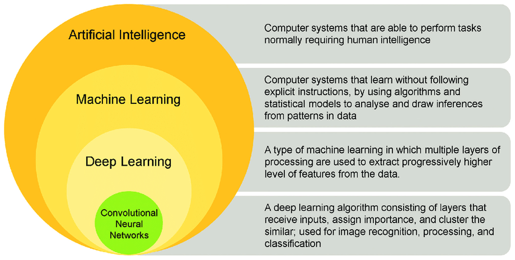
```
.center[.font80[**Fonte**: Honavar (2022).]]

---
## 🧠 Redes Neurais Convolucionais - RNCs


.shadow1[
#### 🤔 Principais Tarefas usando RNCs
]

```{r , echo=FALSE, fig.show = 'hold', out.width = "80%", fig.align = 'center'}
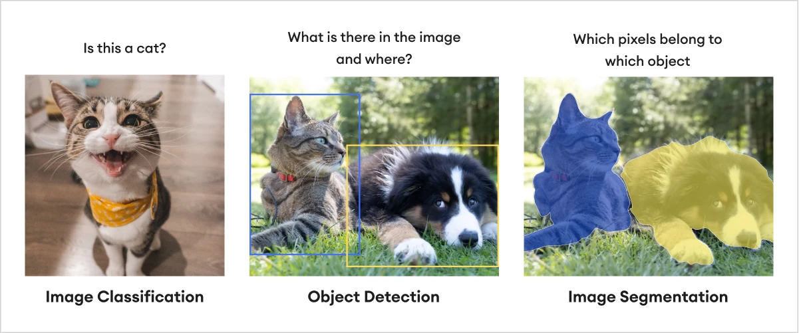
```
.center[.font70[**Fonte**: [https://www.superannotate.com/blog/image-segmentation-for-machine-learning](https://www.superannotate.com/blog/image-segmentation-for-machine-learning)]]


---
## 🧠 Redes Neurais Convolucionais - RNCs

.shadow1[
#### 🤔 Estrutura básica de RNCs para tarefas de Classificação

.font90[
Comumente, uma CNN é composta por 4 partes principais:
- 1 - **Camadas convolucionais** (*Convolutional layers*)
- 2 - **Função de ativação ReLU** - (*Rectified Linear Unit - ReLU*)
- 3 - **Camadas de agrupamento** (*Pooling layers* ou *down-sampling layer* ou *subsampling*)
- 4 - **Camadas totalmente conectadas** (*Fully connected layers*)

👉 .blue[**Essas camadas pode ser divididas em duas partes:**]
- Camadas 1, 2 e 3: Extração de recursos (.green[*Feature extraction*])
- Camada 4: Classificação (.green[*Classification*])

<br>

]
]

---
## 🧠 Redes Neurais Convolucionais - RNCs

.shadow1[
#### 🤔 Estrutura básica de RNCs para tarefas de Classificação
]

```{r , echo=FALSE, fig.show = 'hold', out.width = "70%", fig.align = 'center'}
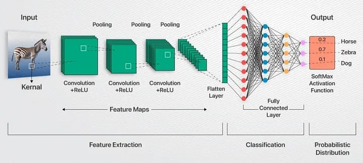
```
.center[.font70[**Fonte**: [https://ravjot03.medium.com/decoding-cnns-a-beginners-guide-to-convolutional-neural-networks-and-their-applications-1a8806cbf536](https://ravjot03.medium.com/decoding-cnns-a-beginners-guide-to-convolutional-neural-networks-and-their-applications-1a8806cbf536)]]

---
## 🧠 Redes Neurais Convolucionais - RNCs

.shadow1[
#### 1 - Camadas convolucionais (.black[*Convolutional layers*])
]

--

.shadow4[
.font90[
.center[🤔 .orange[**OPERAÇÃO DE CONVOLUÇÃO?**] .blue[(Entrada * Kernel)]]
- .blue[**Operação matemática**]: consiste na **multiplicação de matrizes**, porém de forma elementar.<br><br>
- .blue[**Na prática**]: consiste na multiplicação elementar de valores de uma matriz **kernel** (filtros) pelos valores de **pixels de uma imagem** e, em seguida, obteção das **somas dos produtos**. Os filtros são **aplicados à imagem inteira**, deslizando-o da **esquerda para direita** e de **cima para baixo**.<br><br>
- .blue[**Saída**]: **mapa de recursos** (*feature map*) ou **mapa de ativação** (*activation map*). Exibe características específicas que foram detectadas na imagem de entrada.
]
]

---
## 🧠 Redes Neurais Convolucionais - RNCs

.shadow1[
#### 1 - Camadas convolucionais (.black[*Convolutional layers*])
]

--

.shadow4[
.font90[
.center[🤔 .orange[**KERNELS (OU FILTROS)?**]]

- .blue[**Kernels (Filtros)**]: São pequenas **matrizes quadrada** (MxM) com valores (pesos) aleatórios que **deslizam sobre uma imagem de entrada** durante a operação de convolução.<br><br>
- .blue[**Aprendizado**]: Os **valores dos kernels são aprendidos** durante o processo de **treinamento** usando retropropagação. Os valores atualizados ajudam a melhor detectar padrões importantes na imagem.<br><br>
- .blue[**Tamanho e Profundidade**]: Matrizes pequenas (3x3, 5x5 ou 7x7). Profundidade depende do dado de entrada. Por exemplo, se for uma imagem RGB, o **kernel** terá profundidade igual a 3.<br><br>
- .blue[**Importância**]: Cada **kernel** é projetado para detectar **padrões específicos** na imagem (**curvas, bordas, cantos**, etc.). Portanto, influencia na capacidade de extrair recursos relevantes.
]
]

---
## 🧠 Redes Neurais Convolucionais - RNCs

.shadow1[
#### 1 - Camadas convolucionais (.black[*Convolutional layers*])
]

--

.shadow4[
.font90[
.center[🤔 .orange[**OPERAÇÃO DE CONVOLUÇÃO: UMA RÁPIDA INTUIÇÃO...**]]
]
]
<br>

.pull-left-4[
```{r , echo=FALSE, fig.show = 'hold', out.width = "100%", fig.align = 'center'}
knitr::include_graphics('fig/conv/conv1.png')
```
]

--

.pull-right-4[
```{r , echo=FALSE, fig.show = 'hold', out.width = "100%", fig.align = 'center'}
knitr::include_graphics('fig/conv/conv2.png')
```
]

.pull-left-15[
.center[.font80[**Fonte**: O autor (2025).]]
]

---
## 🧠 Redes Neurais Convolucionais - RNCs

.shadow1[
#### 1 - Camadas convolucionais (.black[*Convolutional layers*])
]

--

.shadow4[
.font90[
.center[🤔 .orange[**OPERAÇÃO DE CONVOLUÇÃO: UMA RÁPIDA INTUIÇÃO...**]]
]
]
<br>

.pull-left-4[
```{r , echo=FALSE, fig.show = 'hold', out.width = "100%", fig.align = 'center'}
knitr::include_graphics('fig/conv/conv3.png')
```
]

--

.pull-right-4[
```{r , echo=FALSE, fig.show = 'hold', out.width = "100%", fig.align = 'center'}
knitr::include_graphics('fig/conv/conv4.png')
```
]

.pull-left-15[
.center[.font80[**Fonte**: O autor (2025).]]
]

---
## 🧠 Redes Neurais Convolucionais - RNCs

.shadow1[
#### 1 - Camadas convolucionais (.black[*Convolutional layers*])
]

--

.shadow4[
.font90[
.center[🤔 .orange[**OPERAÇÃO DE CONVOLUÇÃO: UMA RÁPIDA INTUIÇÃO...**]]
]
]
<br>

.pull-left-4[
```{r , echo=FALSE, fig.show = 'hold', out.width = "100%", fig.align = 'center'}
knitr::include_graphics('fig/conv/conv5.png')
```
]

--

.pull-right-4[
```{r , echo=FALSE, fig.show = 'hold', out.width = "100%", fig.align = 'center'}
knitr::include_graphics('fig/conv/conv6.png')
```
]

.pull-left-15[
.center[.font80[**Fonte**: O autor (2025).]]
]

---
## 🧠 Redes Neurais Convolucionais - RNCs

.shadow1[
#### 1 - Camadas convolucionais (.black[*Convolutional layers*])
]

--

.shadow4[
.font90[
.center[🤔 .orange[**OPERAÇÃO DE CONVOLUÇÃO: UMA RÁPIDA INTUIÇÃO...**]]
]
]
<br>

.pull-left-4[
```{r , echo=FALSE, fig.show = 'hold', out.width = "100%", fig.align = 'center'}
knitr::include_graphics('fig/conv/conv7.png')
```
]

--

.pull-right-4[
```{r , echo=FALSE, fig.show = 'hold', out.width = "100%", fig.align = 'center'}
knitr::include_graphics('fig/conv/conv8.png')
```
]

.pull-left-15[
.center[.font80[**Fonte**: O autor (2025).]]
]

---
## 🧠 Redes Neurais Convolucionais - RNCs

.shadow1[
#### 1 - Camadas convolucionais (.black[*Convolutional layers*])
]

--

.shadow4[
.font90[
.center[🤔 .orange[**OPERAÇÃO DE CONVOLUÇÃO: UMA RÁPIDA INTUIÇÃO...**]]
]
]
<br>

```{r , echo=FALSE, fig.show = 'hold', out.width = "60%", fig.align = 'center'}
knitr::include_graphics('fig/conv/conv9.png')
```
.center[.font80[**Fonte**: O autor (2025).]]

---
## 🧠 Redes Neurais Convolucionais - RNCs

.shadow1[
#### 1 - Camadas convolucionais (.black[*Convolutional layers*])
]

.shadow4[
.center[🤔 .orange[**TIPOS DE KERNEL**]]
.font90[
👉 **1 - Kernels de detecção de borda**

- Foram projetados para detectar bordas em uma imagem. Alguns exemplos são:

✔️ .blue[**Filtro Sobel**]: Usado para encontrar bordas horizontais ou verticais.

✔️ .blue[**Filtro Prewitt**]: semelhante ao Sobel, mas usa uma ponderação diferente na matriz para detectar bordas.

✔️ .blue[**Filtro Laplaciano**]: detecta bordas com base na segunda derivada da imagem, fornecendo uma detecção mais detalhada que inclui bordas diagonais.
<br><br>

**Explore o site**: [image-kernels](https://setosa.io/ev/image-kernels/)

]
]

---
## 🧠 Redes Neurais Convolucionais - RNCs

```{r side-by-side-images, echo=FALSE, fig.show = 'hold', out.width = "17%", fig.align = 'default'}
### Figure 1 Title
knitr::include_graphics('code/image.png')
knitr::include_graphics('code/Sobel-V.png')
knitr::include_graphics('code/Prewitt_H.png')
knitr::include_graphics('code/Laplaciano.png')
knitr::include_graphics('code/gaussian_blur.png')
```
.pull-left-15[
.center[.font80[**Fonte**: O autor (2025).]]
]

---
## 🧠 Redes Neurais Convolucionais - RNCs

.pull-left-3[
```{r , echo=FALSE, fig.cap="" , fig.show='hold', out.width='100%', fig.align='center'}
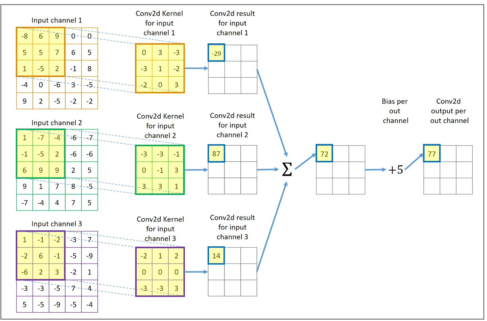
```
.center[.font70[**Fonte**: [https://coolgpu.github.io/coolgpu_blog/github/pages/2020/10/04/convolution.html](https://coolgpu.github.io/coolgpu_blog/github/pages/2020/10/04/convolution.html)]]
]

.pull-right-3[
<br><br><br>
.center[.blue[Operação de convolução em imagens RGB...]]
]

---
## 🧠 Redes Neurais Convolucionais - RNCs

.pull-left-3[
```{r , echo=FALSE, fig.cap="" , fig.show='hold', out.width='100%', fig.align='center'}
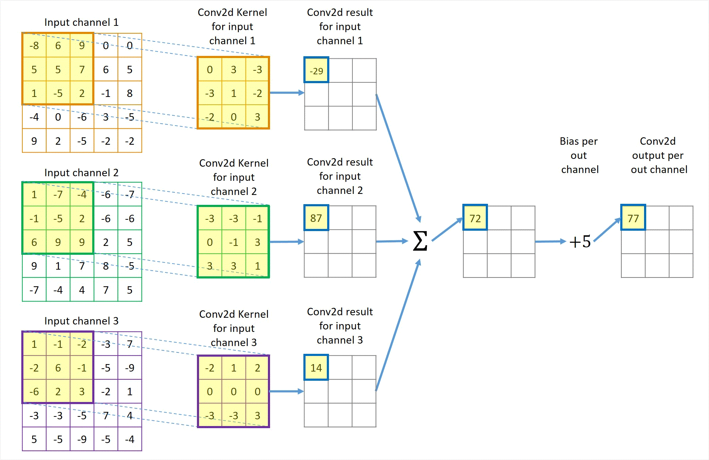
```
.center[.font70[**Fonte**: [https://coolgpu.github.io/coolgpu_blog/github/pages/2020/10/04/convolution.html](https://coolgpu.github.io/coolgpu_blog/github/pages/2020/10/04/convolution.html)]]
]

.pull-right-3[
<br><br><br>
.center[.blue[Operação de convolução em imagens RGB...]]
]

---
## 🧠 Redes Neurais Convolucionais - RNCs

.shadow1[
#### 2 - Função de ativação ReLU - (.black[*Rectified Linear Unit - ReLU*])
]

.shadow4[
.font90[
.center[🤔 .orange[**Rectified Linear Unit - ReLU?**]]

- .blue[**Função de ativação**]: É uma função aplicada após uma camada convolucional. <br><br>
- .blue[**Importância**]: Introduzir **não linearidade** ao modelo. Isso permite a captura de **padrões mais complexos** nos dados.<br><br>
]
]

---
## 🧠 Redes Neurais Convolucionais - RNCs

.shadow1[
#### 2 - Função de ativação ReLU - (.black[*Rectified Linear Unit - ReLU*])
]

.pull-left-4[
```{r , echo=FALSE, fig.cap="" , fig.show='hold', out.width='80%', fig.align='center'}
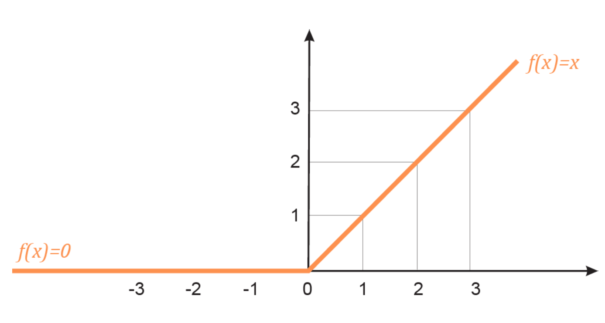
```
.center[.font80[**Fonte**: Es-Sabery et al. (2021).]]
]

.pull-left-4[
<br><br>

$f(x) = \begin{cases} x & \text{if } x \ge 0 \\ 0 & \text{if } x < 0 \end{cases}$

.font80[
- Se a entrada (valor do pixel) ≥ zero (x ≥ 0), a saída será o próprio valor do pixel. Se a entrada for menor < zero (x < 0), a saída será zero.
]

]

---
## 🧠 Redes Neurais Convolucionais - RNCs

.shadow1[
#### 2 - Função de ativação ReLU - (.black[*Rectified Linear Unit - ReLU*])
]

.shadow4[
.font90[
.center[🤔 .orange[**APLICANDO A FUNÇÃO ReLU APÓS A CONVOLUÇÃO: UMA RÁPIDA INTUIÇÃO...**]]
]
]
<br>

```{r , echo=FALSE, fig.cap="" , fig.show='hold', out.width='70%', fig.align='center'}
knitr::include_graphics('fig/relu.png')
```

---
## 🧠 Redes Neurais Convolucionais - RNCs

.shadow1[
#### 3 - Camadas de agrupamento (.black[*Pooling layers* ou *down-sampling layer*])
]

--

.shadow4[
.font90[
.center[🤔 .orange[**OPERAÇÃO DE AGRUPAMENTO?**]]
- .blue[**Redução de dimensionalidade**]: técnica de subamostragem usada para reduzir a dimensão espacial dos mapas de recursos, retendo as informações mais relevantes. (.red[Após a operação de convolução!]) <br><br>
- .blue[**Importância**]: redução do **número de parâmetros treináveis e cálculos** da rede, tornando o modelo mais **rápido e eficiente**. Invariância à translação (.red[extrair características da imagem indenpendente da posição do objeto]. Menos parâmetros ajuda reduzir **overfitting**. <br><br>
- .blue[**Tipos**]: agrupamento máximo (.red[mais usual!]), médio, global e outras.
- .blue[**Na prática**]: Uma pequena janela é definida (2x2, 3x3). Esta janela se move pelo mapa de recursos (.red[resultado da convolução!]) com um passo (**stride**) definido, criando regiões não sobrepostas. Em cada região, o valor (máximo, médio ou global) se torna o pixel de saída do novo mapa de recursos, com menor dimensão.
]
]

---
## 🧠 Redes Neurais Convolucionais - RNCs

.shadow1[
#### 3 - Camadas de agrupamento (.black[*Pooling layers*])
]

--

.shadow4[
.font90[
.center[🤔 .orange[**OPERAÇÃO DE AGRUPAMENTO: UMA RÁPIDA INTUIÇÃO...**]]
]
]
<br>

.pull-left-4[
```{r , echo=FALSE, fig.show = 'hold', out.width = "100%", fig.align = 'center'}
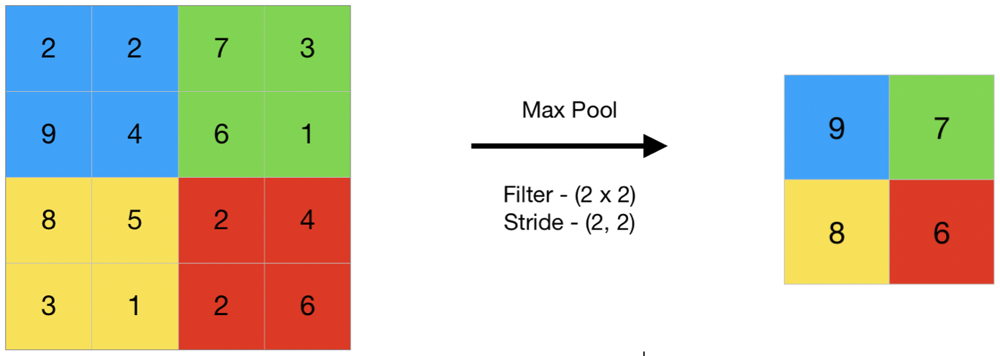
```
]

--

.pull-right-4[
```{r , echo=FALSE, fig.show = 'hold', out.width = "100%", fig.align = 'center'}
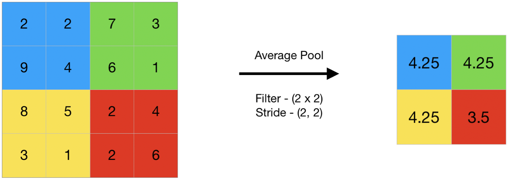
```
]

.pull-left-15[
.font80[
.center[**Fonte**: [https://www.geeksforgeeks.org/deep-learning/cnn-introduction-to-pooling-layer/](https://www.geeksforgeeks.org/deep-learning/cnn-introduction-to-pooling-layer/)

<br>
Na operação de *Pooling*, o *stride* (**tamanho do passo**) é, por padrão, sempre igual ao tamanho do filtro.
]
]
]

---
## 🧠 Redes Neurais Convolucionais - RNCs

.shadow1[
#### 3 - Camadas de agrupamento (.black[*Pooling layers*])
]

--

```{r , echo=FALSE, fig.show = 'hold', out.width = "100%", fig.align = 'center'}
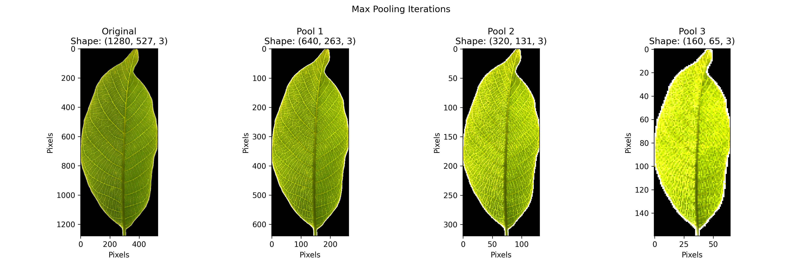
```

---
## 🧠 Redes Neurais Convolucionais - RNCs

.shadow1[
#### 3 - Camadas de agrupamento (.black[*Pooling layers*])
]

--

```{r , echo=FALSE, fig.show = 'hold', out.width = "100%", fig.align = 'center'}
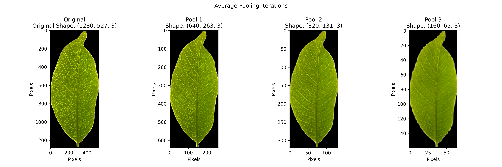
```

---
## 🧠 Redes Neurais Convolucionais - RNCs

.shadow1[
#### 4 - Camadas totalmente conectadas (.black[*Fully connected layers*])
]

.shadow4[
.font90[
.center[🤔 .orange[**MULTILAYER PERCEPTRON - MLP**]]
- .blue[**Rede Neural**]:  Após a etapa de extração de recursos, esses são alimentados para um rede neural do tipo **MultiLayer Perceptron - MLP**. <br><br>
- .blue[**Estrutura MLP**]: Uma MLP é constituída de três tipos de camadas: uma **camada de entrada**, uma ou mais **camadas ocultas** (ou intermediárias) e uma **camada de saída**.

✔️ **Camada de entrada**: Sequência de neurônios que recebe os recursos extraídos na etapa de **Feature Extraction**.

✔️ **Camada oculta**: Sequência de neurônios com pesos que serão aprendidos na etapa de treinamento do modelo.

✔️ **Camada saída**: Sequência de neurônios que possui uma função de ativação. Normalmente, a função **softmax** é usada para obter as probabilidades de classes.

]
]

---
## 🧠 Redes Neurais Convolucionais - RNCs

.shadow1[
#### 🤔 Estrutura básica de RNCs para tarefas de Classificação
]

```{r , echo=FALSE, fig.show = 'hold', out.width = "70%", fig.align = 'center'}

```
.center[.font70[**Fonte**: [https://ravjot03.medium.com/decoding-cnns-a-beginners-guide-to-convolutional-neural-networks-and-their-applications-1a8806cbf536](https://ravjot03.medium.com/decoding-cnns-a-beginners-guide-to-convolutional-neural-networks-and-their-applications-1a8806cbf536)]]

---
## 🧠 Redes Neurais Convolucionais - RNCs

.shadow1[
#### 🤔 Frameworks (TensorFlow)
]

.pull-left-4[
```{r , echo=FALSE, fig.show = 'hold', out.width = "90%", fig.align = 'center'}

```
]

.pull-right-4[

- Desenvolvido pela Google.
- Suporte para diversas linguagens de programação: Python, C++, JavaScript, Java, Go, C# e Julia.
- TensorFlow funciona em dispositivos móveis por meio do TensorFlow Lite (TFLite).

]

---
## 🧠 Redes Neurais Convolucionais - RNCs

.shadow1[
#### 🤔 Frameworks (Pytorch)
]

.pull-left-4[
```{r , echo=FALSE, fig.show = 'hold', out.width = "90%", fig.align = 'center'}

```
]

.pull-right-4[
<br><br>
- Desenvolvido pela Facebook.
- Suporte: Python e C++
- Funciona em plataformas móveis.

]

---
## 🧠 Redes Neurais Convolucionais - RNCs

.shadow1[
#### 🤔 Frameworks (Keras)
]

.pull-left-4[
```{r , echo=FALSE, fig.show = 'hold', out.width = "90%", fig.align = 'center'}

```
]

.pull-right-4[
<br><br>
- É uma API de alto nível.
- Funciona em cima de: Tensorflow, Theano e CNTK
- Muito intuitiva. Simplifica o desenvolvimento de modelos de machine learning e deep learning.

]

---
## 🧠 Redes Neurais Convolucionais - RNCs

.shadow1[
#### 🤔 Transfer learning

- **Definição**: A aprendizagem por transferência (do inglês, *Transfer learning*) refere-se à reutilização de um modelo pré-treinado em um novo problema.
- **Motivação**: Menor tempo de treinamento. Conjunto de dados limitados.
- **Denominação**: Redes Neurais Convolucionais Pré-Treinadas (*Pre-trained CNNs*). <br><br>

]
<br>

.center[.blue[Em geral, treinar uma CNN do zero requer muitos dados, que nem sempre estão disponíveis!]]

---
## 🧠 Redes Neurais Convolucionais - RNCs

.shadow1[
#### 🤔 Algumas Redes Pré-Treinadas para Classificação disponíveis no **Keras**
]

```{r , echo=FALSE, fig.show = 'hold', out.width = "50%", fig.align = 'center'}
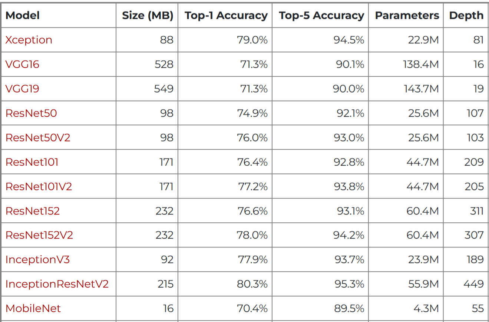
```
.center[.font70[**Fonte**: [https://keras.io/api/applications/](https://keras.io/api/applications/)]]

---
## 🧠 Redes Neurais Convolucionais - RNCs

.shadow1[
#### 🤔 Arquitetura da rede **VGG-16**
]

```{r , echo=FALSE, fig.show = 'hold', out.width = "60%", fig.align = 'center'}
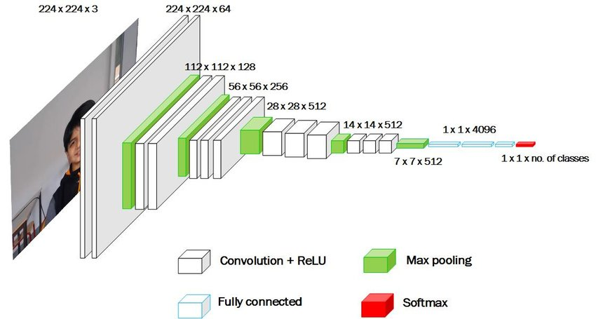
```
.center[.font80[**Fonte**: Khan et al. (2019).]]

---
## 🧠 Redes Neurais Convolucionais - RNCs

.shadow1[
#### 🤔 Transfer learning vs Fine Tuning
]

```{r , echo=FALSE, fig.show = 'hold', out.width = "50%", fig.align = 'center'}
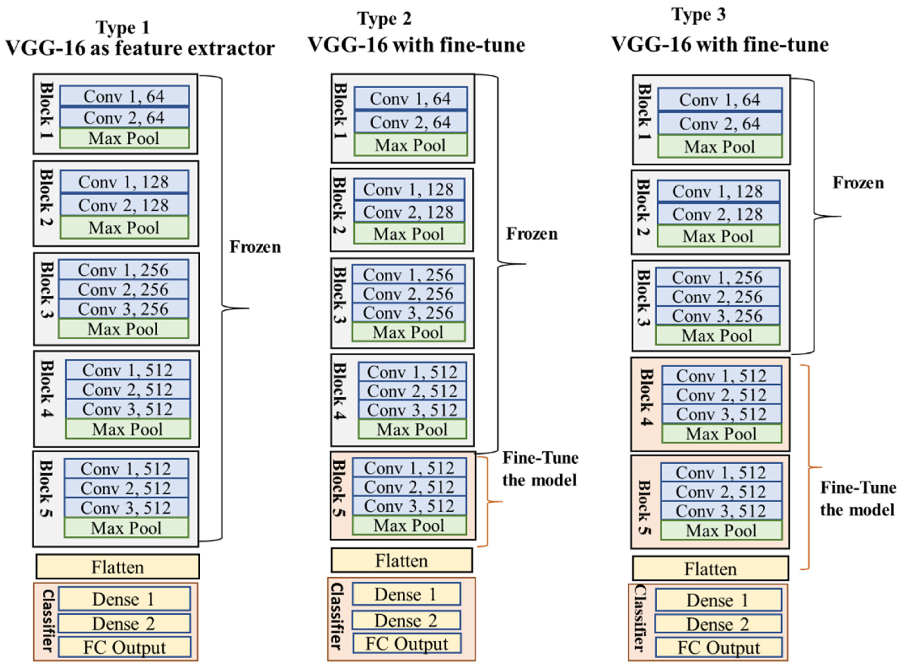
```
.center[.font80[**Fonte**: Islam et al. (2023).]]


<!-- Slide XX -->
---
class: inverse
layout: false
background-image: url(fig/sec.png)
background-size: cover

## **RNCs: Aplicações populares <br> e nas Ciênciais Florestais:**
### (Detectção, Segmentação e Classificação)

---
layout: true
background-image:  url(fig/LMFTCA.png), url(fig/cont.png)
background-position: 99% 94%
background-size: 100px, cover
---
## 🔍 Aplicações populares

<br>
.center[**Tarefa**: .green[Detecção de pedestres...]]
<br>

```{r , echo=FALSE, fig.show='hold', out.width='60%', fig.align='center'}
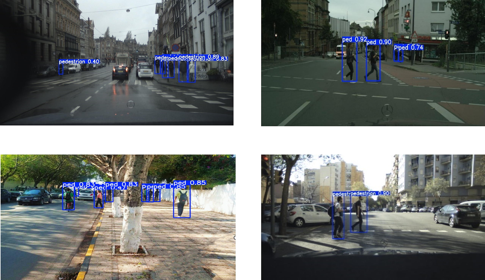
```
.center[.font80[**Fonte**: Farhat et al. (2025).]]

---
## 🔍 Aplicações populares

<br>
.center[**Tarefa**: .green[Detecção e classificação por carros autônomos...]]
<br>

.pull-left-4[
```{r , echo=FALSE, fig.show='hold', out.width='90%', fig.align='center'}
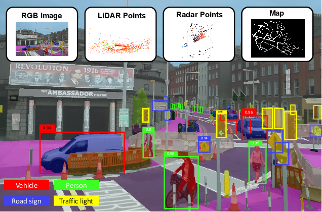
```
]

.pull-right4[
```{r , echo=FALSE, fig.show='hold', out.width='43%', fig.align='center'}
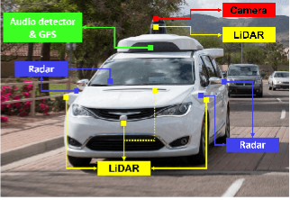
```
]

.pull-left-15[
.center[.font80[**Fonte**: Feng et al. (2020).]]
]

---
## 🔍 Aplicações populares

<br>
.center[**Tarefa**: .green[Reconhecimento de Emoções Faciais...]]
<br>

```{r , echo=FALSE, fig.show='hold', out.width='60%', fig.align='center'}
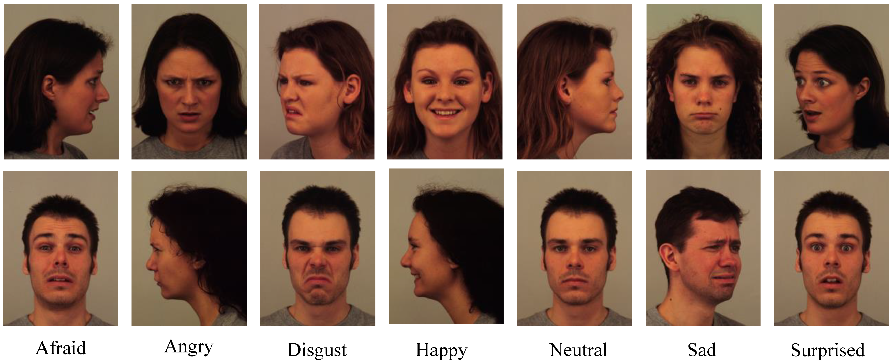
```
.center[.font80[**Fonte**: Akhand et al. (2021).]]

---
## 🔍 Aplicações populares

<br>
.center[**Tarefa**: .green[Reconhecimento Facial...]]
<br>

```{r , echo=FALSE, fig.show='hold', out.width='80%', fig.align='center'}
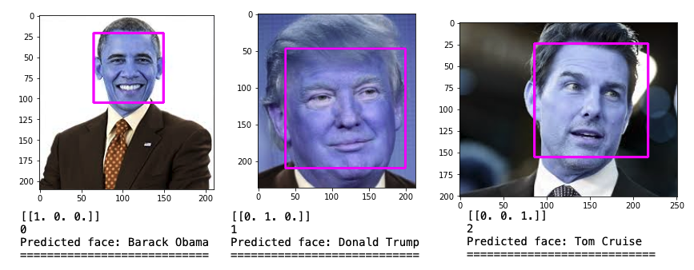
```
.center[.font60[**Fonte**: https://www.codemag.com/Article/2205081/Implementing-Face-Recognition-Using-Deep-Learning-and-Support-Vector-Machines.]]

---
## 🔍 Aplicações de CNN nas Ciênciais Florestais

```{r , echo=FALSE, fig.show='hold', out.width='80%', fig.align='center'}
knitr::include_graphics('fig/appcf.png')
```
.center[.font80[**Fonte**: O autor (2025).]]

---
## 🔍 Aplicações de CNN nas Ciênciais Florestais

<br>
.center[**Tarefa**: .green[Detecção, Segmentação e Estimativa]]
.center[.blue[Detecção de troncos de árvores e estimativa de diâmetro...]]
<br>
```{r , echo=FALSE, fig.show='hold', out.width='90%', fig.align='center'}
knitr::include_graphics('fig/grondin.jpeg')
```
.center[.font80[**Fonte**: Grondin et al. (2023).]]

---
## 🔍 Aplicações de CNN nas Ciênciais Florestais

.pull-left-9[
```{r , echo=FALSE, fig.show='hold', out.width='90%', fig.align='center'}
knitr::include_graphics('fig/Fu.jpg')
```
.center[.font80[**Fonte**: Fu et al. (2024).]]
]

.pull-right-9[
.center[**Tarefa**: .green[Detecção]]
.center[.blue[Detecção de copas de árvores (Mask R-CNN)...]]

.font80[
- (a) Rótulo de verdade básica sobreposto com mapa de cores reais de UAV. 
- (b) Detecção de copas de árvores usando RGB-CHM-DSM. 
- (c) Detecção de copas de árvores usando RGB-CHM. 
- (d) Detecção de copas de árvores usando RGB-DSM. 
- (e) Detecção de copas de árvores usando RGB.

.center[.green[**Acurácia > 87%, recall > 90% e F1-score > 89%**]]
]
]

---
## 🔍 Aplicações de CNN nas Ciênciais Florestais

.pull-left-9[
<br><br>
```{r , echo=FALSE, fig.show='hold', out.width='100%', fig.align='center'}
knitr::include_graphics('fig/Fu2.jpg')
```
.center[.font80[**Fonte**: Fu et al. (2024).]]

<br>

**Cores diferentes representam alturas diferentes...**

]

.pull-right-9[
<br><br>
.center[**Tarefa**: .green[Detecção]]

.center[.blue[Detecção simultânea da altura e da copa da árvore (Mask R-CNN)]]

.font80[
- (a), (c), (e) e (g): mostram a imagem composta em cores verdadeiras do UAV (R-Red, G-Green, B-Blue)
- (b), (d), (f) e (h): são os resultados da detecção da altura da árvore.

.center[.green[**(R² = 0,93; RMSE = 0,25; rRMSE = 3,10)**]]
]
]

---
## 🔍 Aplicações de CNN nas Ciênciais Florestais
<br>
.center[**Tarefa**: .green[Detecção]]
.center[.blue[Monitoramento de doenças em florestas de Pinus (Mask R-CNN) - VANT...]]

```{r , echo=FALSE, fig.show='hold', out.width='90%', fig.align='center'}
knitr::include_graphics('fig/Hu.jpg')
```

.font80[
- (a): Pinheiros doentes
- (b): Pinheiros mortos
- (c): Pinheiros doentes e mortos

.center[**Fonte**: Hu et al. (2022).]
]

---
## 🔍 Aplicações de CNN nas Ciênciais Florestais
<br>
.center[**Tarefa**: .green[Detecção]]
.center[.blue[Monitoramento de doenças em florestas de Pinus (Mask R-CNN) - VANT...]]

```{r , echo=FALSE, fig.show='hold', out.width='90%', fig.align='center'}
knitr::include_graphics('fig/Hu2.jpg')
```

.font80[
- **Caixas amarelas**: indicam os pinheiros mortos.
- **Caixas vermelhas**: indicam os pinheiros doentes.

.center[**Fonte**: Hu et al. (2022).]
]

---
## 🔍 Aplicações de CNN nas Ciênciais Florestais

.pull-left-9[
```{r , echo=FALSE, fig.show='hold', out.width='100%', fig.align='center'}
knitr::include_graphics('fig/Ehtis1.jpg')
```
.center[.font80[**Fonte**: Ehtisham et al. (2024).]]
]

.pull-right-9[
<br><br>
.center[**Tarefa**: .green[Detecção e Segmentação]]

.center[.blue[Avaliação da qualidade da superfície da madeira serrada...]]

.font80[
- Cracks (**Rachaduras**)
- knots (**Nós**)
- Undamaged (**Sem danos**)
]
]

---
## 🔍 Aplicações de CNN nas Ciênciais Florestais

.pull-left-9[
```{r , echo=FALSE, fig.show='hold', out.width='70%', fig.align='center'}
knitr::include_graphics('fig/Ehtis2.jpg')
```
.center[.font80[**Fonte**: Ehtisham et al. (2024).]]
]

.pull-right-9[
<br><br>
.center[**Tarefa**: .green[Detecção e Segmentação]]

.center[.blue[Avaliação da qualidade da superfície da madeira serrada...]]

.font80[
- Cracks (**Rachaduras**)
- knots (**Nós**)
- Undamaged (**Sem danos**)
]
]

---
## 🔍 Aplicações de CNN nas Ciênciais Florestais
<br>
.pull-left-9[
```{r , echo=FALSE, fig.show='hold', out.width='100%', fig.align='center'}
knitr::include_graphics('fig/Ehtis3.jpg')
```
.center[.font80[**Fonte**: Ehtisham et al. (2024).]]
]

.pull-right-9[
<br><br>
.center[**Tarefa**: .green[Detecção e Segmentação]]

.center[.blue[Avaliação da qualidade da superfície da madeira serrada...]]

.font80[
- Cracks (**Rachaduras**)
- knots (**Nós**)
- Undamaged (**Sem danos**)
]
]

---
## 🔍 Aplicações de CNN nas Ciênciais Florestais
<br>
.pull-left-9[
```{r , echo=FALSE, fig.show='hold', out.width='100%', fig.align='center'}
knitr::include_graphics('fig/Ehtis4.jpg')
```
.center[.font80[**Fonte**: Ehtisham et al. (2024).]]
]

.pull-right-9[
<br><br>
.center[**Tarefa**: .green[Detecção]]

.center[.blue[Avaliação da qualidade da superfície da madeira serrada...]]

.font80[
- Cracks (**Rachaduras**)
- knots (**Nós**)
- Undamaged (**Sem danos**)
]
]

---
## 🔍 Aplicações de CNN nas Ciênciais Florestais
<br>
.pull-left-9[
```{r , echo=FALSE, fig.show='hold', out.width='70%', fig.align='center'}
knitr::include_graphics('fig/Sun.png')
```
.center[.font80[**Fonte**: Sun et al. (2021).]]
]

.pull-right-9[
<br>
.center[**Tarefa**: .green[Classificação]]

.center[.blue[Classificação de espécies de madeira baseado em imagens macroscópicas...]]

.font80[
- Abordagem: ResNet50 
- Acurácia: 99,6%
- Número de Espécies: 25
- Origem: China
- Número de imagens: 3.000
]
]

---
## 🔍 Aplicações de CNN nas Ciênciais Florestais
<br>
.pull-left-3[
```{r , echo=FALSE, fig.show='hold', out.width='100%', fig.align='center'}
knitr::include_graphics('fig/Sun2.png')
```
.center[.font80[**Fonte**: Sun et al. (2021).]]
]

.pull-right-3[
<br>
.center[**Tarefa**: .green[Classificação]]

.center[.blue[Classificação de espécies de madeira baseado em imagens macroscópicas...]]

.font80[
- Abordagem: ResNet50 
- Acurácia: 99,6%
- Número de Espécies: 25
- Origem: China
- Número de imagens: 3.000
]
]

---
## 🔍 Aplicações de CNN nas Ciênciais Florestais
<br>
.pull-left-9[
```{r , echo=FALSE, fig.show='hold', out.width='70%', fig.align='center'}
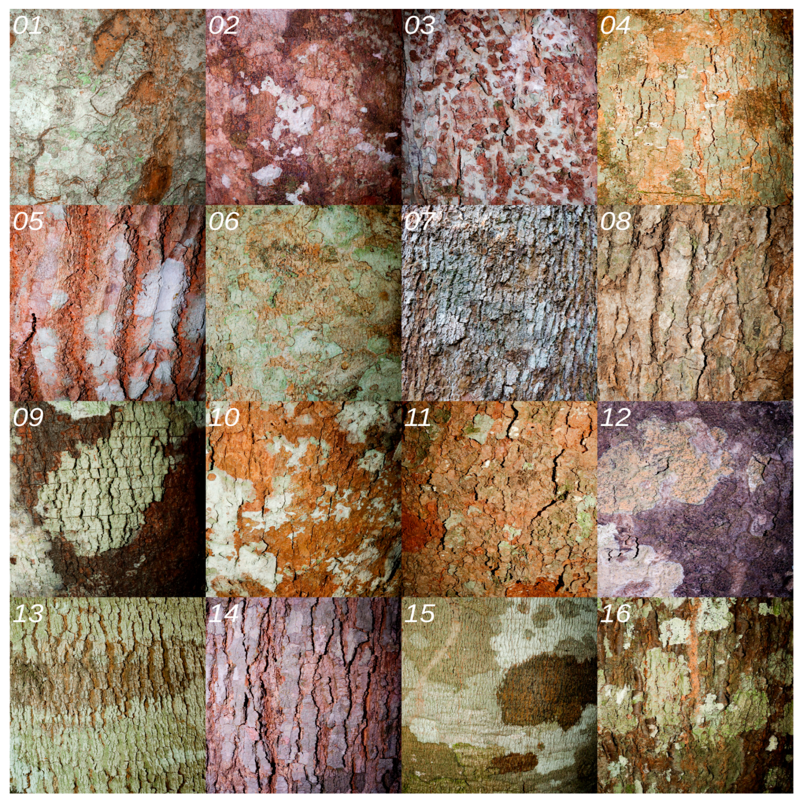
```
.center[.font80[**Fonte**: Gama et al. (2025).]]
]

.pull-right-9[
<br>
.center[**Tarefa**: .green[Classificação]]

.center[.blue[Classificação de espécies de madeira baseado em imagens de casca externa de árvores...]]

.font80[
- Abordagem: ResNet50 (Extração de Recursos) + SVM (Classificador)
- Acurácia: 95%
- Número de Espécies: 16
- Origem: Brasil (Floresta Amazônica) - Espécies Comerciais
- Número de imagens: 2.803
]
]

<!-- Slide XX -->
---
class: inverse
layout: false
background-image: url(fig/deepflora.png), url(fig/sec.png)
background-position: 99% 90%
background-size: 350px, cover

## .font90[**Projeto DeepFlora: <br> Inteligência Artificial para Reconhecer <br> Árvores da Amazônia**]
### *(DeepFlora: Artificial Intelligence to Recognize Amazonian Trees)*

---
layout: true
background-image: url(fig/deepflora.png), url(fig/cont.png)
background-position: 99% 99%
background-size: 400px, cover
---
## 🖥️Projeto DeepFlora

.shadow1[
#### 🔍 **Projeto de Pesquisa, Desenvolvimento e Inovação Florestal**

👉 **Objetivo**: Desenvolver um **sistema de reconhecimento automático de espécies florestais** de valor comercial madeireiro, usando **imagens digitais de partes de árvores** (cascas externa (ritidoma), alburno e forma da base de troncos) e técnicas de **aprendizado profundo** (*Deep Learning*), visando a **melhoria da acurácia na identificação de espécies** da flora Amazônica no âmbito Manejo Florestal Sustentável para fins madeireiros.

]

<br>

.shadow3[Desenvolver um **sistema baseado em IA e Visão Computacional** que possa servir como **ferramenta auxiliar na identificação de árvores** no MFS para fins de exploração madeireira
]


---
## 🏫 Instituições Parceiras e Financiador

.pull-left-11[
.pull-left-11[
```{r ufpa, echo=FALSE, fig.show='hold', out.width='70%', fig.align='center'}
knitr::include_graphics('fig/ufpa.png')
```
]

.pull-right-11[
```{r ufrrj, echo=FALSE, fig.show='hold', out.width='70%', fig.align='center'}
knitr::include_graphics('fig/UFRRJ.png')
```
]

.pull-bottom[
.pull-left-11[
<br><br>
```{r ufpr, echo=FALSE, fig.show='hold', out.width='80%', fig.align='center'}
knitr::include_graphics('fig/UFPR.png')
```
]

.pull-right-11[
```{r ufra, echo=FALSE, fig.show='hold', out.width='70%', fig.align='center'}
knitr::include_graphics('fig/UFRA.png')
```
]
]
]

## .center[💰 Financiador]
.pull-right-11[
```{r cipem, echo=FALSE, fig.show='hold', out.width='50%', fig.align='center'}
knitr::include_graphics('fig/CIPEM.png')
```
]

---
layout: true
background-image: url(fig/deepflora.png), url(fig/cont.png)
background-position: 3% 95%
background-size: 400px, cover
---
## 🤔 Motivação

.pull-left-5[
<br><br>
.brand-red[.center[**Por que desenvolver um sistema de reconhecimento automático de espécies da flora?**]]
]

--

.pull-right-5[
```{r, echo=FALSE, out.width='85%', fig.align='center', fig.cap=''}
knitr::include_graphics('fig/mot.png')
```
.center[.font80[**Fonte**: O autor (2025).]]
]

---
## 🤔 Motivação

.pull-left-5[
<br><br>
.brand-red[.center[**Estudos reportaram altas taxas de erros de identificação de espécies em PMFS na Amazônia brasileira...**]]
]

--

.pull-right-5[
```{r, echo=FALSE, out.width='90%', fig.align='center', fig.cap=''}
knitr::include_graphics('fig/research1.png')
```
.center[.font80[**Fonte**: O autor (2025).]]
]

---
## 🤔 Motivação


.pull-left-5[
<br><br>
.brand-red[.center[**Estudos reportaram altas taxas de erros de identificação de espécies em PMFS na Amazônia brasileira...**]]
]

--

.pull-right-5[
```{r, echo=FALSE, out.width='95%', fig.align='center', fig.cap=''}
knitr::include_graphics('fig/research2.png')
```
.center[.font80[**Fonte**: O autor (2025).]]
]

---
layout: true
background-image: url(fig/deepflora.png), url(fig/cont.png)
background-position: 99% 99%
background-size: 400px, cover
---
## 🤔 Motivação

.shadow1[
👉 **Instrução Normativa 28, de 11 de dezembro de 2024/IBAMA**
.font80[
Estabelece os procedimentos relativos às atividades de **Manejo Florestal Sustentável das espécies** listadas no **Anexo II** da Convenção sobre o Comércio Internacional das Espécies da Flora e Fauna Selvagens em Perigo de Extinção - **CITES**, dos gêneros .blue[*Handroanthus, Tabebuia, Dipteryx e Cedrela*], por recomendação do Parecer de Extração Não Prejudicial; e as regras de transição para autorização de exportação de produtos e subprodutos madeireiros desses gêneros oriundos de florestas nativas do bioma amazônico. 
]
]

<br>

.pull-left-4[
.font80[
| Gênero         | FOA/FE/S/C |     | FOD |     |
|--------------  |------------|-----|-----|-----|
|                | DMC        | IME | DMC | IME |
| *Handroanthus* | 60         | 70  | 70  | 70  |
| *Tabebuia*     | 60         | 70  | 70  | 70  |
| *Dipteryx*     | 60         | 75  | 80  | 75  |
| *Cedrela*      | 55         | 70  | 70  | 50  |
.center[.font80[**Fonte**: O autor (2025).]]
<br>
.font70[Acesse aqui: [Instrução Normativa 28, de 11 de dezembro de 2024/IBAMA](https://www.ibama.gov.br/component/legislacao/?view=legislacao&legislacao=139446)]
]
]

.pull-right-4[
.font80[
FOA = Floresta Ombrófila Aberta/FE = Floresta Estacional/S = Savana/C = Campinarana

FOD = Floresta Ombrófila Densa

DMC = Diâmetro Mínimo de Corte, em cm

IME = Intensidade Máxima de Exploração, em %
]
]

---
layout: true
background-image: url(fig/deepflora.png), url(fig/cont.png)
background-position: 3% 95%
background-size: 400px, cover
---
## 🤔 Motivação

.pull-left-5[
<br><br>
.brand-red[.center[**Art. 12.** A identificação das espécies descritas deverá ser realizada no âmbito do POA, utilizando uma das metodologias a seguir:]
]
]

--

.pull-right-5[
```{r, echo=FALSE, out.width='85%', fig.align='center', fig.cap=''}
knitr::include_graphics('fig/IN28.png')
```
.center[.font80[**Fonte**: O autor (2025)]]
]

---
## 🌳 Sistemas Automáticos: Quais possibilidades?

```{r, echo=FALSE, out.width='70%', fig.align='center', fig.cap=''}
knitr::include_graphics('fig/sist.png')
```
.center[.font80[**Fonte**: O autor (2025).]]

---
layout: true
background-image: url(fig/deepflora.png), url(fig/cont.png)
background-position: 99% 99%
background-size: 400px, cover
---
## 🌎 Áreas de Coletas

```{r, echo=FALSE, out.width='58%', fig.align='center', fig.cap=''}
knitr::include_graphics('fig/map.png')
```
.center[.font80[**Fonte**: Gama et al. (2025).]]

---
## Variáveis coletadas

.pull-left-9[
.shadow1[
#### 📝 **Variáveis coletadas**
]

.shadow4[
- Imagens da planta: Casca externa, alburno e forma da base do tronco
- Coordenadas Geográficas
- Diâmetro a 1,30 m do solo
- Altura (clinômetro Haglof)
- Espessura da casca
- Escalada de árvores para coleta de material botânico
]
]

.pull-right-9[
```{r, echo=FALSE, out.width='90%', fig.align='center', fig.cap=''}
knitr::include_graphics('fig/mosaico.png')
```
.center[.font80[**Fonte**: Acervo do autor (2025).]]
]

---
layout: true
background-image: url(fig/deepflora2.png), url(fig/cont.png)
background-position: 100% 50%
background-size: 200px, cover
---
## 🌳 Imagens de Partes da Planta

.pull-left-15[
.pull-left-17[
```{r, echo=FALSE, out.width='75%', fig.align='center', fig.cap=''}
knitr::include_graphics('fig/parkia.png')
```
]

.pull-left-17[
```{r, echo=FALSE, out.width='75%', fig.align='center', fig.cap=''}
knitr::include_graphics('fig/sima.png')
```
]
.center[.font80[**Fonte**: Acervo do autor (2025).]]
]

---
## 🍃 Identificação de Espécies
<br>

```{r, echo=FALSE, out.width='60%', fig.align='center', fig.cap=''}
knitr::include_graphics('fig/bot.png')
```
.center[.font80[**Fonte**: Acervo do autor (2025).]]
<br>

.center[.font80[**Coletas botânicas**: .blue[83 espécimes de 16 espécies (no mínimo 5 árvores por espécie)]]]

---
## 🍃 Identificação de Espécies
<br>

```{r, echo=FALSE, out.width='65%', fig.align='center', fig.cap=''}
knitr::include_graphics('fig/press.png')
```
.center[.font80[**Fonte**: Acervo do autor (2025).]]

.font80[.center[.blue[Exsicatas foram enviadas e incorporadas ao Herbário Felisberto Camargo (HFC) <br> da Universidade Federal Rural da Amazônia....]]]

---
## 🍃 Rotulação de imagens

.pull-left-10[
#### .center[🤔 Importância da identificação de espécies para a correta rotulação de imagens]

.font80[
👉 **Rotulação de imagens**: Processo de anotar e classificar o conteúdo de imagens para, posteriormente, treinar modelos baseados em técnicas de visão computacional.]
<br>

.center[.blue[A qualidade da rotulação de imagens afeta diretamente a acurácia do modelo!]]

]

.pull-right-10[
```{r, echo=FALSE, out.width='55%', fig.align='center', fig.cap=''}
knitr::include_graphics('fig/comp.png')
knitr::include_graphics('fig/comp2.png')
```
.center[.font80[**Fonte**: Acervo do autor (2025).]]
]

---
layout: true
background-image: url(fig/deepflora.png), url(fig/cont.png)
background-position: 99% 99%
background-size: 400px, cover
---
## 📷 Amazon Bark Dataset

.pull-left-9[
.shadow1[
#### **Amazon Bark Dataset**
]

.shadow4[
- Denominação: **Amazon Bark** (Cascas Externas)
- Sítios: **3 Áreas de Manejo Florestal**
- Número de imagens: **2.803 imagens**
- Número de Gêneros/Espécies/Família: **16/16/9**
- Número de árvores por espécie: **10**
- Dois dispositivos:

1) **Câmera Canon EOS Rebel** (3024 x 4032 pixels) 

2) **iPhone 11** (4000 x 5328 pixels)

- Distância de captura: 20 cm a 40 cm do tronco
- Altura de captura: 0,30 m a 1,40 m do solo
]
]

.pull-right-9[
<br><br><br>
```{r, echo=FALSE, out.width='100%', fig.align='center', fig.cap=''}
knitr::include_graphics('fig/trio.jpg')
```
.center[.font80[**Fonte**: Acervo do autor (2025).]]
]

---
## 📷 Amazon Bark Dataset
<br>

```{r, echo=FALSE, out.width='65%', fig.align='center', fig.cap=''}
knitr::include_graphics('fig/treebark.png')
```
.center[.font80[**Fonte**: Gama et al., 2025]]

---
layout: true
background-image: url(fig/deepflora2.png), url(fig/cont.png)
background-position: 98% 50%
background-size: 200px, cover
---
## 📷 Amazon Bark Dataset

.pull-left-11[
```{r, echo=FALSE, out.width='79%', fig.align='center', fig.cap=''}
knitr::include_graphics('fig/bark.jpg')
```
]

.pull-left-11[
```{r, echo=FALSE, out.width='75%', fig.align='center', fig.cap=''}
knitr::include_graphics('fig/esp.png')
```
]

---
layout: true
background-image: url(fig/deepflora.png), url(fig/cont.png)
background-position: 99% 99%
background-size: 400px, cover
---
## 🌳 DeepBark - Aplicação Web

.shadow1[
#### **DeepBark: Reconhecendo Árvores Comerciais a partir de Imagens da Casca**

.shadow80[
.font80[
- **Nome**: .blue[**Deep**] (*Deep Learning*) e .blue[**Bark**] (*Casca*)
- **Aplicação Web**: Sistema baseado em .blue[visão computacional e aprendizado profundo] (*deep learning*) para reconhecer .blue[16 espécies] da flora Amazônica de valor comercial madeireiro, baseado em .blue[imagens digitais de cascas externas] (ritidoma) de árvores.
- **Modelo de Reconhecimento**: .orange[Natally Celestino Gama] (Dissertação de Mestrado/PPGBC/UFPA)
- **Acesse aqui**: [Dissertação de Mestrado](chrome-extension://efaidnbmnnnibpcajpcglclefindmkaj/https://ppgbc.propesp.ufpa.br/ARQUIVOS/dissertacoes/2024/Natally_Celestino_07.06.24.pdf)
<br>
]
]
]

---
layout: true
background-image: url(fig/deepflora2.png), url(fig/cont.png)
background-position: 100% 50%
background-size: 200px, cover
---
## 👩‍🔬 Publicação científica

.pull-left-16[
```{r, echo=FALSE, out.width='80%', fig.align='center', fig.cap=''}
knitr::include_graphics('fig/paper.png')
```

.center[.font80[**Acesse aqui**: [Gama et al., 2025](https://doi.org/10.3390/f16091374)]]
]

---
## 🌳 DeepBark - Aplicação Web (Modelo)

.pull-left-16[
```{r, echo=FALSE, out.width='80%', fig.align='center', fig.cap=''}
knitr::include_graphics('fig/deepbark.png')
```
.center[.font80[**Fonte**: O autor (2025).]]
.center[.font80[**Acurácia**: .blue[95%] (de cada 100 imagens acerta 95)]]
]

---
## 🌳 DeepBark - Aplicação Web (Interface)

.pull-left-16[
```{r, echo=FALSE, out.width='90%', fig.align='center', fig.cap=''}
knitr::include_graphics('fig/inter.png')
```
.center[.font80[**Fonte**: O autor (2025).]]
]

---
## 🌳 DeepBark - Aplicação Web (Funcionamento)

.center[
<iframe width="760" height="515" src="https://www.youtube.com/embed/a6-HWc7GDJw?si=9zpwC3DdqiFdghzn" title="YouTube video player" frameborder="0" allow="accelerometer; autoplay; clipboard-write; encrypted-media; gyroscope; picture-in-picture; web-share" referrerpolicy="strict-origin-when-cross-origin" allowfullscreen></iframe>
]
.center[.font80[**Fonte**: O autor (2025).]]

---
## 🌳 DeepBark - Aplicação Web (Considerações finais)

.pull-left-16[
```{r, echo=FALSE, out.width='90%', fig.align='center', fig.cap=''}
knitr::include_graphics('fig/lim.png')
```
.center[.font80[**Fonte**: O autor (2025).]]
]

---
## 📖 Referências

.pull-left-16[
.font80[
<br>
Akhand, M. A. H., Roy, S., Siddique, N., Kamal, M. A. S., & Shimamura, T. (2021). Facial emotion recognition using transfer learning in the deep CNN. Electronics, 10(9), 1036.
<br><br>
Alam, G. M. I., Tasnia, N., Biswas, T., Hossen, M. J., Tanim, S. A., & Miah, M. S. U. (2025). Real-Time Detection of Forest Fires Using FireNet-CNN and Explainable AI Techniques. IEEE Access.
<br><br>
Andrade, B. G., Basso, V. M., & de Figueiredo Latorraca, J. V. (2020). Machine vision for field-level wood identification. Iawa Journal, 41(4), 681-698.
<br><br>
Binta Islam, S., Valles, D., Hibbitts, T. J., Ryberg, W. A., Walkup, D. K., & Forstner, M. R. (2023). Animal species recognition with deep convolutional neural networks from ecological camera trap images. Animals, 13(9), 1526.
<br><br>
De Bem, P. P., de Carvalho Junior, O. A., Fontes Guimarães, R., & Trancoso Gomes, R. A. (2020). Change detection of deforestation in the Brazilian Amazon using landsat data and convolutional neural networks. Remote Sensing, 12(6), 901.

]
]

---
## 📖 Referências

.pull-left-16[
.font80[
<br>
Ecke, S., Stehr, F., Frey, J., Tiede, D., Dempewolf, J., Klemmt, H. J., ... & Seifert, T. (2024). Towards operational UAV-based forest health monitoring: Species identification and crown condition assessment by means of deep learning. Computers and Electronics in Agriculture, 219, 108785.
<br><br>
Ehtisham, R., Qayyum, W., Camp, C. V., Plevris, V., Mir, J., Khan, Q. U. Z., & Ahmad, A. (2024). Computing the characteristics of defects in wooden structures using image processing and CNN. Automation in Construction, 158, 105211.
<br><br>
Es-Sabery, F., Hair, A., Qadir, J., Sainz-De-Abajo, B., García-Zapirain, B., & De La Torre-Díez, I. (2021). Sentence-level classification using parallel fuzzy deep learning classifier. IEEE Access, 9, 17943-17985.
<br><br>
Farhat, W., Rhaiem, O. B., Faiedh, H., & Souani, C. (2025). Optimized deep learning for pedestrian safety in autonomous vehicles. International Journal of Transportation Science and Technology.
<br><br>
Feng, D., Haase-Schütz, C., Rosenbaum, L., Hertlein, H., Glaeser, C., Timm, F., ... & Dietmayer, K. (2020). Deep multi-modal object detection and semantic segmentation for autonomous driving: Datasets, methods, and challenges. IEEE Transactions on Intelligent Transportation Systems, 22(3), 1341-1360.

]
]

---
## 📖 Referências

.pull-left-16[
.font80[
<br>
Figueroa-Mata, G., Mata-Montero, E., Valverde-Otárola, J. C., Arias-Aguilar, D., & Zamora-Villalobos, N. (2022). Using deep learning to identify Costa Rican native tree species from wood cut images. Frontiers in Plant Science, 13, 789227.
<br><br>
Fu, H., Zhao, H., Jiang, J., Zhang, Y., Liu, G., Xiao, W., ... & Liu, X. (2024). Automatic detection tree crown and height using Mask R-CNN based on unmanned aerial vehicles images for biomass mapping. Forest Ecology and Management, 555, 121712.
<br><br>
GAMA, N. C. Reconhecimento automático de espécies florestais amazônicas a partir de imagens de cascas baseado em padrões binários locais e aprendizado profundo. 2024. Dissertação (Mestrado em Biodiversidade e Conservação) – Universidade Federal do Pará, Altamira, 2024. Disponível em: [Link](chrome-extension://efaidnbmnnnibpcajpcglclefindmkaj/https://ppgbc.propesp.ufpa.br/ARQUIVOS/dissertacoes/2024/Natally_Celestino_07.06.24.pdf). Acesso em: 25 ago. 2025.
<br><br>
Geus, A. R., Silva, S. F. D., Gontijo, A. B., Silva, F. O., Batista, M. A., & Souza, J. R. (2020). An analysis of timber sections and deep learning for wood species classification. Multimedia Tools and Applications, 79(45), 34513-34529.
<br><br>
Grondin, V., Fortin, J. M., Pomerleau, F., & Giguère, P. (2023). Tree detection and diameter estimation based on deep learning. Forestry, 96(2), 264-276.
]
]

---
## 📖 Referências

.pull-left-16[
.font80[
<br>
Honavar, S. G. (2022). Artificial intelligence in ophthalmology-Machines think!. Indian Journal of Ophthalmology, 70(4), 1075-1079.
<br><br>
Hu, G., Wang, T., Wan, M., Bao, W., & Zeng, W. (2022). UAV remote sensing monitoring of pine forest diseases based on improved Mask R-CNN. International Journal of Remote Sensing, 43(4), 1274-1305.
<br><br>
Khan, R. A., Crenn, A., Meyer, A., & Bouakaz, S. (2019). A novel database of children's spontaneous facial expressions (LIRIS-CSE). Image and Vision Computing, 83, 61-69.
<br><br>
Kobayashi, K.; Akada, M.; Torigoe, T.; Imazu, S.; Sugiyama, J. Automated recognition of wood used in traditional japanese sculptures by texture analysis of their low-resolution computed tomography data. J. Wood Sci. 2015, 61, 630–640.
<br><br>
Kobayashi, K.; Hwang, S.-W.; Okochi, T.; Lee, W.-H.; Sugiyama, J. Non-destructive method for wood identification using conventional X-ray computed tomography data. J. Cult. Herit. 2019, 38, 88–93.
]
]

---
## 📖 Referências

.pull-left-16[
.font80[
<br>
LACERDA, A. E. B.; NIMMO, E. R. Can we really manage tropical forests without knowing the species within? getting back to the basics of forest management through taxonomy. Forest Ecology and Management, Elsevier, v. 259, n. 5, p. 995–1002, 2010.
<br><br>
Li W, Fu H, Yu L (2017) Deep convolutional neural network based large-scale oil palm tree detection for high-resolution remote sensing images. In: 2017 IEEE International Geoscience and Remote Sensing Symposium (IGARSS). IEEE. https://doi.org/10.1109/IGARSS.2017.8127085
<br><br>
Luo W, Wang DL, Xia LG et al. 2019 A forestry resource investigation method based on deep learning. For Sci Technol. https://doi.org/10.13456/j.cnki.lykt.2019.07.03.0005 (in Chinese)
<br><br>
Malta, A., Lopes, J., Salas-González, R., Fidalgo, B., Farinha, T., & Mendes, M. (2023). Pinus pinaster diameter, height, and volume estimation using mask-RCNN. Sustainability, 15(24), 16814.
<br><br>
Martins, J., Oliveira, L. S., Nisgoski, S., & Sabourin, R. (2013). A database for automatic classification of forest species. Machine vision and applications, 24(3), 567-578.

]
]

---
## 📖 Referências

.pull-left-16[
.font80[
<br>
Nezami, S., Khoramshahi, E., Nevalainen, O., Pölönen, I., & Honkavaara, E. (2020). Tree species classification of drone hyperspectral and RGB imagery with deep learning convolutional neural networks. Remote Sensing, 12(7), 1070.
<br><br>
PROCÓPIO, L. C.; SECCO, R. S. A importância da identificação botânica nos inventários florestais: o exemplo do "tauari" (*Couratari* spp. e *Cariniana* spp.- Lecythidaceae) em duas áreas manejadas no estado do Pará. Acta amazônica, v. 38, p. 31-44, 2008.
<br><br>
Ren S, He K, Girshick R et al (2017) Faster R-CNN: Towards Real-Time Object Detection with Region Proposal Networks. IEEE T Pattern Anal 39(6):1137–1149. https://doi.org/10.1109/TPAMI.2016.2577031
<br><br>
Rosa da Silva, N., De Ridder, M., Baetens, J.M. et al. Automated classification of wood transverse cross-section micro-imagery from 77 commercial Central-African timber species. Annals of Forest Science 74, 30 (2017). https://doi.org/10.1007/s13595-017-0619-0
<br><br>
Schäfer, J., Winiwarter, L., Weiser, H., Höfle, B., Schmidtlein, S., Novotný, J., ... & Fassnacht, F. E. (2024). CNN-based transfer learning for forest aboveground biomass prediction from ALS point cloud tomography. European Journal of Remote Sensing, 57(1), 2396932.

]
]

---
## 📖 Referências

.pull-left-16[
.font80[
<br>
Sun, Y., Lin, Q., He, X., Zhao, Y., Dai, F., Qiu, J., & Cao, Y. (2021). Wood species recognition with small data: A deep learning approach. International Journal of Computational Intelligence Systems, 14(1), 1451-1460.
<br><br>
Wang, Y., Zhang, W., Gao, R., Jin, Z., & Wang, X. (2021). Recent advances in the application of deep learning methods to forestry. Wood Science and Technology, 55(5), 1171-1202.
<br><br>
Xia CJ, Wang PL, Zhang Y (2015) Prediction of moisture content of wood based on deep learning. J Hangzhou Dianzi Univ (nat Sci) 35(1):31–35
<br><br>
Yadav, A. R., Anand, R. S., Dewal, M. L., & Gupta, S. (2015). Gaussian image pyramid based texture features for classification of microscopic images of hardwood species. Optik, 126(24), 5570-5578.
<br><br>
Ye L, Gao L, Marcos-Martinez R et al (2019) Projecting Australia’s forest cover dynamics and exploring influential factors using deep learning. Environ Modell Softw 119:407–417. https://doi.org/10.1016/j.envsoft.2019.07.013

]
]

---
## 📖 Referências

.pull-left-16[
.font80[
<br>
Zhang, G., Wang, M., & Liu, K. (2019). Forest fire susceptibility modeling using a convolutional neural network for Yunnan province of China. International Journal of Disaster Risk Science, 10(3), 386-403.
<br><br>
Zheng, C., Liu, S., Wang, J., Lu, Y., Ma, L., Jiao, L., ... & He, T. (2024). Opening the black box: explainable deep-learning classification of wood microscopic image of endangered tree species. Plant Methods, 20(1), 56.
<br><br>
Zhu, M., Wang, J., Wang, A., Ren, H., & Emam, M. (2021). Multi-fusion approach for wood microscopic images identification based on deep transfer learning. Applied Sciences, 11(16), 7639.

]
]

---

layout: false
name: etim
class: inverse, middle, center
background-image: url(fig/title.jpg)
background-size: cover

## .font200[Obrigado!]

```{r, echo=FALSE, out.width='20%', fig.align='center', fig.cap='', dpi=600}
knitr::include_graphics('fig/LMFTCA.png')
```

👨🏻‍👩🏻‍👦🏻‍👦🏻 [@lmftca_ufpa](https://www.instagram.com/lmftca_ufpa/)

🌎 [https://www.lmftca.com.br/](https://www.lmftca.com.br/)


