class: title-slide, center, middle
background-image: url(fig/LMFTCA.png), url(fig/ufpa.png), url(fig/PPGBC.png), url(fig/PPGCTIF.PNG), url(fig/title.jpg)
background-position: 90% 5%, 10% 5%, 10% 90%, 90% 90%
background-size: 130px, 110px, 150px, 130px, cover

```{r setup, include=FALSE}
knitr::opts_chunk$set(
  fig.showtext = TRUE,
  fig.align = "center", 
  fig.show='hold',
  cache = TRUE,
  error = FALSE,
  message = FALSE, 
  warning = FALSE, 
  collapse = TRUE ,
  dpi = 600)
```

```{r icon, echo=FALSE}
#remotes::install_github("mitchelloharawild/icons")
#library(icons)
#download_fontawesome()
#download_simple_icons()
```

```{r packages, include=FALSE}
# remotes::install_github("dill/emoGG")
library(ggplot2)
library(dplyr)
library(ggimage)
```


<!-- title-slide -->
<br>
##### Universidade Federal do Pará (UFPA)
##### Faculdade de Engenharia Florestal
##### Laboratório de Manejo Florestal, Tecnologias e Comunidades Amazônicas
##### Programa de Pós-Graduação em Biodiversidade e Conservação (PPGBC)/UFPA
##### Programa de Pós-Graduação em Ciência, Tecnologia e Inovação Florestal (PPGCTIF)/UFOPA

## Reconhecimento de Espécies de Plantas Usando Recursos de Imagens: Um enfoque nas Redes Neurais Convolucionais (RNCs)
### *Plant Species Recognition Using Image Features: A Focus on Convolutional Neural Networks (CNNs)*
<br>
`r anicon::faa("pagelines", animate="horizontal", colour="green", size = 2)`
`r anicon::faa("tree", animate="float", colour="green", size = 2)`
<br>
##### 〰〰〰〰〰〰〰〰〰🌳〰〰〰〰〰〰〰〰〰
##### .font120[**Deivison Venicio Souza**]
##### Professor Associado I - UFPA
##### E-mail: deivisonvs@ufpa.br
##### 👨🏻‍👩🏻‍👦🏻‍👦🏻 [@lmftca_ufpa](https://www.instagram.com/lmftca_ufpa/)
##### 🌎 [https://www.lmftca.com.br/](https://www.lmftca.com.br/)
<br>
##### 1ª versão: 08/setembro/2025 <br> (Atualizado em: `r format(Sys.Date(),"%d/%B/%Y")`) <br> Altamira, Pará

---
layout: true
background-image:  url(fig/LMFTCA.png), url(fig/cont.png)
background-position: 99% 94%
background-size: 100px, cover

---
layout: true
background-image: url(fig/deepflora.png), url(fig/cont.png)
background-position: 80% 50%
background-size: 600px, cover
---
## 📙 Conteúdo
<br>

.pull-top[
👉 **Parte 1 - Redes Neurais Convolucionais - RNCs**
.font80[

[3 - Redes Neurais Convolucionais (RNCs)](#ia)

&nbsp;&nbsp;[3.1 - O que são?](#TA)

&nbsp;&nbsp;[3.2 - Arquitetura](#TA)

&nbsp;&nbsp;[3.3 - Redes Neurais Convolucionais Pré-Treinadas](#TA)

&nbsp;&nbsp;[3.4 - Frameworks (Tensorflow, keras, PyTorch)](#TA)

[3 - Métodos de Reamostragem](#rea) 

[4 - Medidas de Desempenho](#des)

]
]

---
## 📙 Conteúdo
<br>

.pull-top[
👉 **Parte 2 - Aplicações de CNN nas Ciênciais Florestais**
.font80[

[1 - Detecção de troncos de árvores](#mot)

[2 - Estimativa de diâmetro de árvores](#mot)

[3 - Detecção de simultânea de altura e copa de árvores](#mot)

[4 - Detecção de doenças em copas de árvores](#mot)

]
]

---
## 📙 Conteúdo
<br>

.pull-top[
👉 **Parte 3 - Projeto DeepFlora**
.font80[

[1 - Projeto DeepFlora](#mot)

[2 - Instituições Parceiras e Financiador](#ins)

[3 - Motivação](#mot)

[4 - Sistemas Automáticos: Quais possibilidades?](#sist)

[4 - Áreas de Coleta](#ac)

[5 - Variáveis coletadas](#ac)

[6 - Imagens de Partes da Planta](#img)

[7 - Identificação de Espécies](#ide)

[8 - Rotulação de imagens](#rot)

[9 - Amazon Bark Dataset](#abd)

[10 - DeepBark - Aplicação Web](#dee)

]
]

<!-- Slide XX -->
---
class: inverse
layout: false
background-image: url(fig/sec.png)
background-size: cover

## .font80[**Redes Neurais Convolucionais (RNCs) <br> (*Convolutional Neural Networks - CNNs*)**]
### (Definição, Camadas, Arquiteturas, Frameworks, ...)

---
layout: true
background-image:  url(fig/LMFTCA.png), url(fig/cont.png)
background-position: 96% 8%
background-size: 100px, cover
---
## 🧠 Convolutional Neural Networks - CNNs

.shadow1[
#### 🤔 Definição
Redes Neurais Convolucionais são algoritmos de Inteligência Artificial baseados em redes neurais multicamadas (*multi-layer neural networks*) que aprendem características relevantes a partir de imagens, sendo capazes de realizar diversas tarefas, como classificação, detecção e segmentação de objetos.
]
<br><br>

.center[.blue[As CNNs tentam imitar como o cérebro humano opera para reconhecer padrões e características em imagens.]]


---
## 🧠 Convolutional Neural Networks - CNNs


Imagens das tarefas


---
## 🧠 Convolutional Neural Networks - CNNs

.shadow1[
#### 🤔 Estrutura de CNNs

.font90[
Comumente, uma CNN é composta por 4 partes principais:
- **Camadas convolucionais** (*Convolutional layers*)
- **Função de ativação ReLU** - (*Rectified Linear Unit - ReLU*)
- **Camadas de agrupamento** (*Pooling layers*)
- **Camadas totalmente conectadas** (*Fully connected layers*)

<br>
]
]

---
## 🧠 Convolutional Neural Networks - CNNs

.shadow1[
#### 🤔 Estrutura de CNNs

.font90[
Comumente, uma CNN é composta por 4 partes principais:
- **1 - Camadas convolucionais** (*Convolutional layers*)
- **2 - Função de ativação ReLU** - (*Rectified Linear Unit - ReLU*)
- **3 - Camadas de agrupamento** (*Pooling layers*)
- **4 - Camadas totalmente conectadas** (*Fully connected layers*)

<br>
]
]

---
## 🧠 Convolutional Neural Networks - CNNs


Figura com uma CNN

---
## 🧠 Convolutional Neural Networks - CNNs

.shadow1[
#### 1 - Camadas convolucionais (.black[*Convolutional layers*])
]

--

.shadow4[
.font90[
.center[🤔 .orange[**OPERAÇÃO DE CONVOLUÇÃO?**] .blue[(Entrada * Kernel)]]
- .blue[**Operação matemática**]: consiste na **multiplicação de matrizes**, porém de forma elementar.<br><br>
- .blue[**Na prática**]: consiste na multiplicação elementar de valores de uma matriz **kernel** (filtros) pelos valores de **pixels de uma imagem** e, em seguida, obteção das **somas dos produtos**. Os filtros são **aplicados à imagem inteira**, deslizando-o da **esquerda para direita** e de **cima para baixo**.<br><br>
- .blue[**Saída**]: mapa de recursos (*feature map*) ou mapa de ativação (*activation map*). Exibe características específicas que foram detectadas na imagem de entrada.
]
]


---
## 🧠 Convolutional Neural Networks - CNNs

.shadow1[
#### 1 - Camadas convolucionais (.black[*Convolutional layers*])
]

--

.shadow4[
.font90[
.center[🤔 .orange[**KERNELS (OU FILTROS)?**]]

- .blue[**Kernels (Filtros)**]: São pequenas **matrizes quadrada** (MxM) com valores (pesos) aleatórios que **deslizam sobre uma imagem de entrada** durante a operação de convolução.<br><br>
- .blue[**Aprendizado**]: Os **valores dos kernels são aprendidos** durante o processo de **treinamento** usando retropropagação. Os valores atualizados ajudam a melhor detectar padrões importantes na imagem.<br><br>
- .blue[**Tamanho e Profundidade**]: Matrizes pequenas (3x3, 5x5 ou 7x7). Profundidade depende do dado de entrada. Por exemplo, se for uma imagem RGB, o **kernel** terá profundidade igual a 3.<br><br>
- .blue[**Importância**]: Cada **kernel** é projetado para detectar **padrões específicos** na imagem (**curvas, bordas, cantos**, etc.). Portanto, influencia na capacidade de extrair recursos relevantes.
]
]

---
## 🧠 Convolutional Neural Networks - CNNs

.shadow1[
#### 1 - Camadas convolucionais (.black[*Convolutional layers*])
]

--

.shadow4[
.font90[
.center[🤔 .orange[**OPERAÇÃO DE CONVOLUÇÃO: UMA RÁPIDA INTUIÇÃO...**]]
]
]
<br>

.pull-left-4[
```{r , echo=FALSE, fig.show = 'hold', out.width = "100%", fig.align = 'center'}
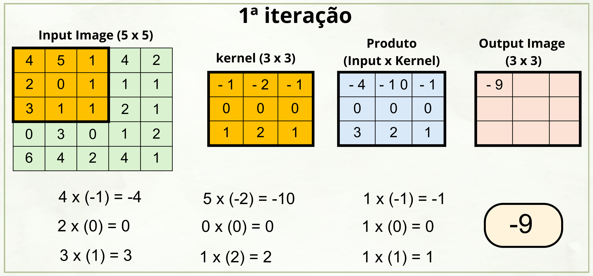
```
]

--

.pull-right-4[
```{r , echo=FALSE, fig.show = 'hold', out.width = "100%", fig.align = 'center'}
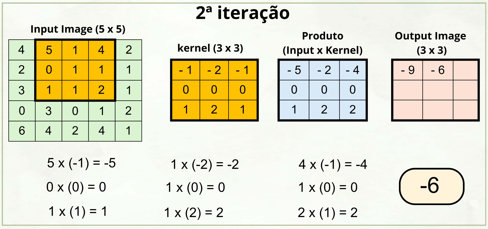
```
]

.pull-left-15[
.center[.font80[**Fonte**: O autor (2025).]]
]

---
## 🧠 Convolutional Neural Networks - CNNs

.shadow4[
.font90[
.center[🤔 .orange[**OPERAÇÃO DE CONVOLUÇÃO: UMA RÁPIDA INTUIÇÃO...**]]
]
]

```{r , echo=FALSE, fig.show = 'hold', out.width = "30%", fig.align = 'default'}
knitr::include_graphics('fig/conv/conv3.png')
knitr::include_graphics('fig/conv/conv4.png')
knitr::include_graphics('fig/conv/conv5.png')
```

```{r , echo=FALSE, fig.show = 'hold', out.width = "30%", fig.align = 'default'}
knitr::include_graphics('fig/conv/conv6.png')
knitr::include_graphics('fig/conv/conv7.png')
knitr::include_graphics('fig/conv/conv8.png')
```

```{r , echo=FALSE, fig.show = 'hold', out.width = "30%", fig.align = 'center'}
knitr::include_graphics('fig/conv/conv9.png')
```

---
## 🧠 Convolutional Neural Networks - CNNs

.shadow1[
#### 1 - Camadas convolucionais (.black[*Convolutional layers*])
]

.shadow4[
.center[🤔 .orange[**TIPOS DE KERNEL**]]
.font90[
👉 **1 - Kernels de detecção de borda**

- Foram projetados para detectar bordas em uma imagem. Alguns exemplos são:

✔️ .blue[**Filtro Sobel**]: Usado para encontrar bordas horizontais ou verticais.

✔️ .blue[**Filtro Prewitt**]: semelhante ao Sobel, mas usa uma ponderação diferente na matriz para detectar bordas.

✔️ .blue[**Filtro Laplaciano**]: detecta bordas com base na segunda derivada da imagem, fornecendo uma detecção mais detalhada que inclui bordas diagonais.

]
]

---
## 🧠 Convolutional Neural Networks - CNNs

```{r side-by-side-images, echo=FALSE, fig.show = 'hold', out.width = "17%", fig.align = 'default'}
### Figure 1 Title
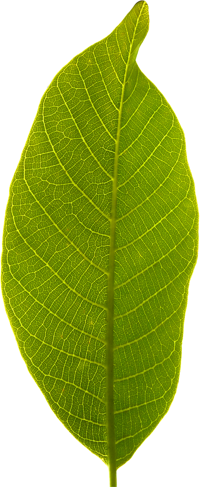
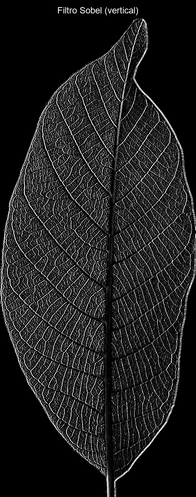
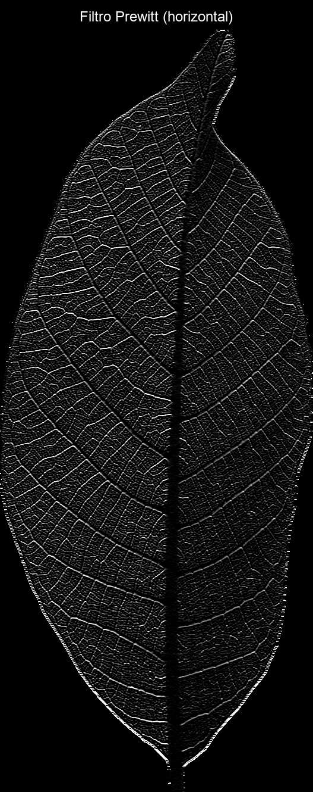
knitr::include_graphics('code/Laplaciano.png')
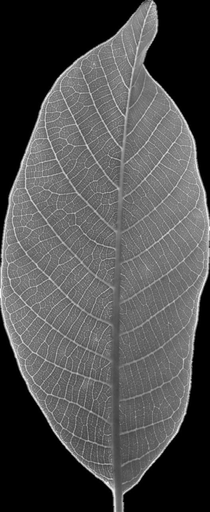
```
.pull-left-15[
.center[.font80[**Fonte**: O autor (2025).]]
]

---
## 🧠 Convolutional Neural Networks - CNNs

.shadow1[
#### 🤔 Camadas convolucionais (*Convolutional layers*)

.font90[
👉 **Kernels de convolução?**

<br>
]
]

---
## 🧠 Convolutional Neural Networks - CNNs

.pull-left-3[
```{r , echo=FALSE, fig.cap="" , fig.show='hold', out.width='100%', fig.align='center'}
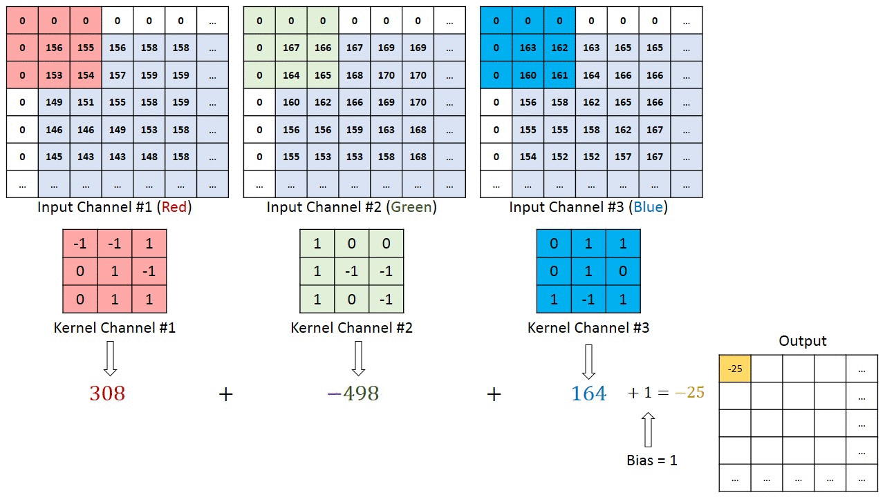
```
.center[.font80[**Fonte**: [https://miro.medium.
com/max/1600/1*ciDgQEjViWLnCbmX-EeSrA.gif](https://miro.medium.
com/max/1600/1*ciDgQEjViWLnCbmX-EeSrA.gif)]]
]

.pull-right-3[
<br><br><br>
.center[.blue[Operação de convolução em imagens RGB...]]
]

<!-- Slide XX -->
---
class: inverse
layout: false
background-image: url(fig/sec.png)
background-size: cover

## **Aplicações de CNN nas <br> Ciênciais Florestais:**
### (Detectção, Segmentação e Classificação)

---
layout: true
background-image:  url(fig/LMFTCA.png), url(fig/cont.png)
background-position: 99% 94%
background-size: 100px, cover
---
## 🔍 Aplicações de CNN nas Ciênciais Florestais

```{r , echo=FALSE, fig.show='hold', out.width='80%', fig.align='center'}
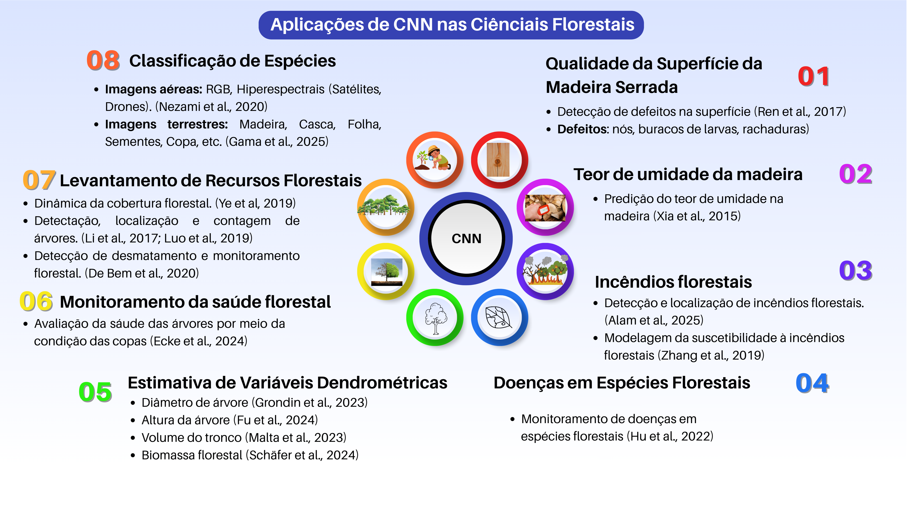
```
.center[.font80[**Fonte**: O autor (2025).]]

---
## 🔍 Aplicações de CNN nas Ciênciais Florestais

<br>
.center[**Tarefa**: .green[Detecção, Segmentação e Estimativa]]
.center[.blue[Detecção de troncos de árvores e estimativa de diâmetro...]]
<br>
```{r , echo=FALSE, fig.show='hold', out.width='90%', fig.align='center'}
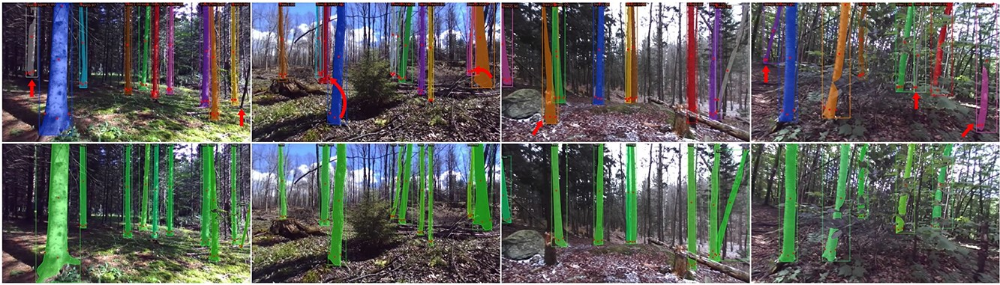
```
.center[.font80[**Fonte**: Grondin et al. (2023).]]

---
## 🔍 Aplicações de CNN nas Ciênciais Florestais

.pull-left-9[
```{r , echo=FALSE, fig.show='hold', out.width='90%', fig.align='center'}
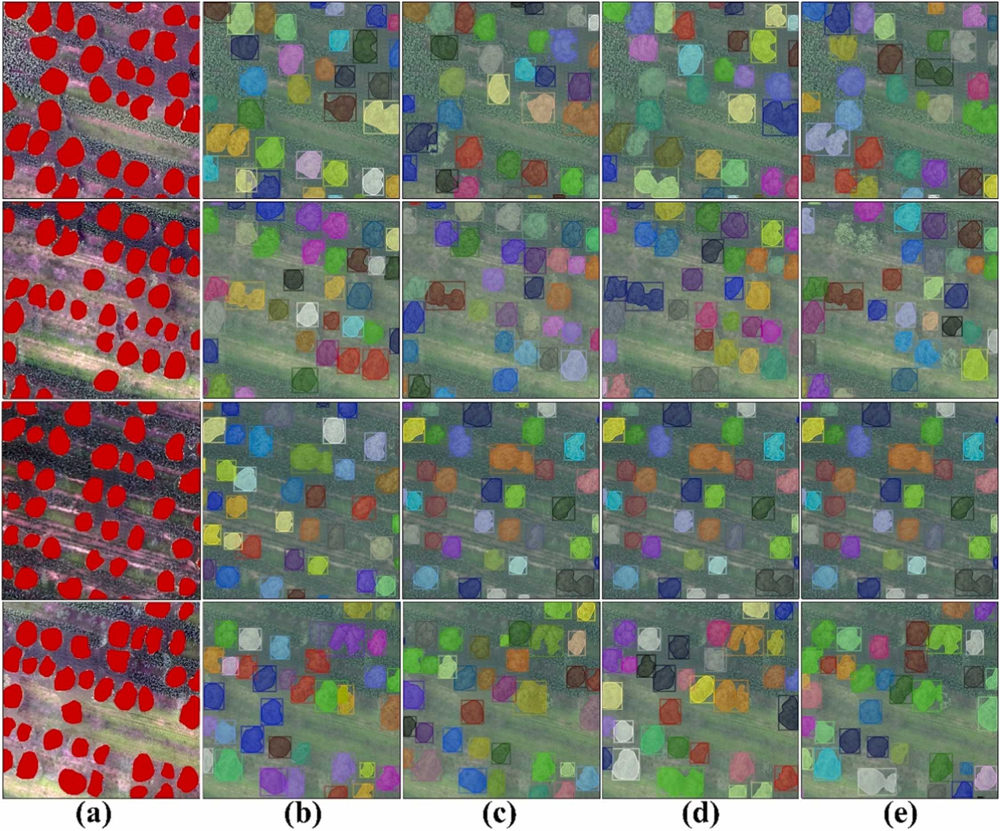
```
.center[.font80[**Fonte**: Fu et al. (2024).]]
]

.pull-right-9[
.center[**Tarefa**: .green[Detecção]]
.center[.blue[Detecção de copas de árvores (Mask R-CNN)...]]

.font80[
- (a) Rótulo de verdade básica sobreposto com mapa de cores reais de UAV. 
- (b) Detecção de copas de árvores usando RGB-CHM-DSM. 
- (c) Detecção de copas de árvores usando RGB-CHM. 
- (d) Detecção de copas de árvores usando RGB-DSM. 
- (e) Detecção de copas de árvores usando RGB.

.center[.green[**Acurácia > 87%, recall > 90% e F1-score > 89%**]]
]
]

---
## 🔍 Aplicações de CNN nas Ciênciais Florestais

.pull-left-9[
<br><br>
```{r , echo=FALSE, fig.show='hold', out.width='100%', fig.align='center'}
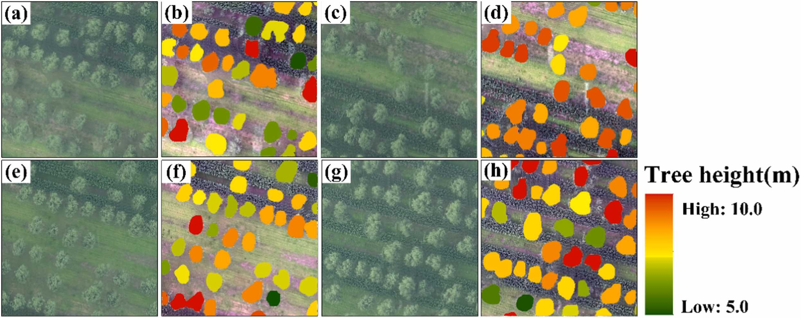
```
.center[.font80[**Fonte**: Fu et al. (2024).]]

<br>

**Cores diferentes representam alturas diferentes...**

]

.pull-right-9[
<br><br>
.center[**Tarefa**: .green[Detecção]]

.center[.blue[Detecção simultânea da altura e da copa da árvore (Mask R-CNN)]]

.font80[
- (a), (c), (e) e (g): mostram a imagem composta em cores verdadeiras do UAV (R-Red, G-Green, B-Blue)
- (b), (d), (f) e (h): são os resultados da detecção da altura da árvore.

.center[.green[**(R² = 0,93; RMSE = 0,25; rRMSE = 3,10)**]]
]
]

---
## 🔍 Aplicações de CNN nas Ciênciais Florestais
<br>
.center[**Tarefa**: .green[Detecção]]
.center[.blue[Monitoramento de doenças em florestas de Pinus (Mask R-CNN) - VANT...]]

```{r , echo=FALSE, fig.show='hold', out.width='90%', fig.align='center'}
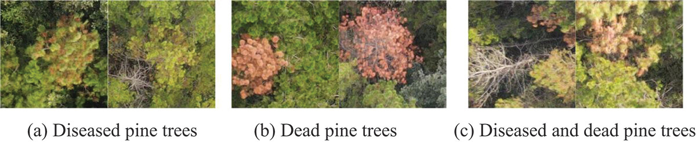
```

.font80[
- (a): Pinheiros doentes
- (b): Pinheiros mortos
- (c): Pinheiros doentes e mortos

.center[**Fonte**: Hu et al. (2022).]
]

---
## 🔍 Aplicações de CNN nas Ciênciais Florestais
<br>
.center[**Tarefa**: .green[Detecção]]
.center[.blue[Monitoramento de doenças em florestas de Pinus (Mask R-CNN) - VANT...]]

```{r , echo=FALSE, fig.show='hold', out.width='90%', fig.align='center'}
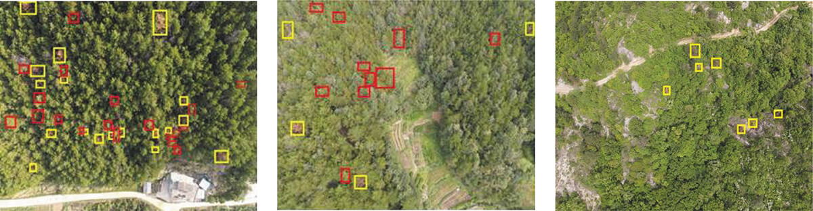
```

.font80[
- **Caixas amarelas**: indicam os pinheiros mortos.
- **Caixas vermelhas**: indicam os pinheiros doentes.

.center[**Fonte**: Hu et al. (2022).]
]

---
## 🔍 Aplicações de CNN nas Ciênciais Florestais

.pull-left-9[
```{r , echo=FALSE, fig.show='hold', out.width='100%', fig.align='center'}
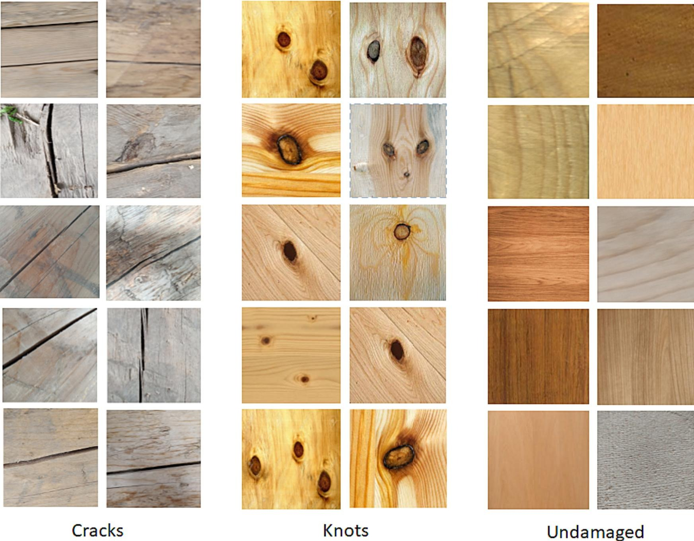
```
.center[.font80[**Fonte**: Ehtisham et al. (2024).]]
]

.pull-right-9[
<br><br>
.center[**Tarefa**: .green[Detecção e Segmentação]]

.center[.blue[Avaliação da qualidade da superfície da madeira serrada...]]

.font80[
- Cracks (**Rachaduras**)
- knots (**Nós**)
- Undamaged (**Sem danos**)
]
]

---
## 🔍 Aplicações de CNN nas Ciênciais Florestais

.pull-left-9[
```{r , echo=FALSE, fig.show='hold', out.width='70%', fig.align='center'}
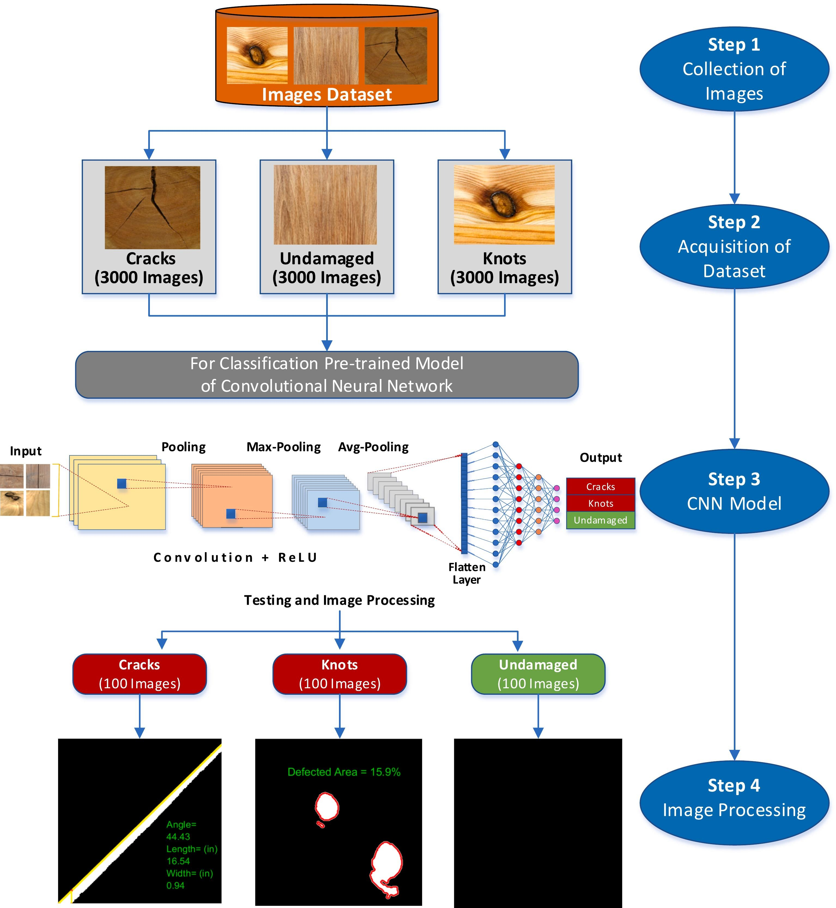
```
.center[.font80[**Fonte**: Ehtisham et al. (2024).]]
]

.pull-right-9[
<br><br>
.center[**Tarefa**: .green[Detecção e Segmentação]]

.center[.blue[Avaliação da qualidade da superfície da madeira serrada...]]

.font80[
- Cracks (**Rachaduras**)
- knots (**Nós**)
- Undamaged (**Sem danos**)
]
]

---
## 🔍 Aplicações de CNN nas Ciênciais Florestais
<br>
.pull-left-9[
```{r , echo=FALSE, fig.show='hold', out.width='100%', fig.align='center'}
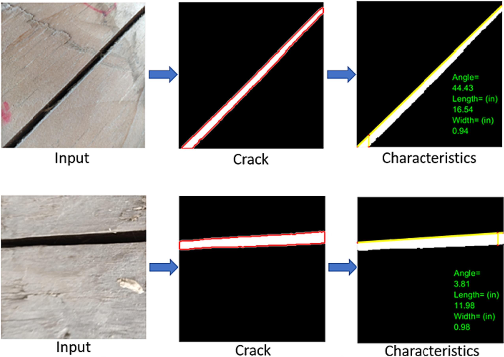
```
.center[.font80[**Fonte**: Ehtisham et al. (2024).]]
]

.pull-right-9[
<br><br>
.center[**Tarefa**: .green[Detecção e Segmentação]]

.center[.blue[Avaliação da qualidade da superfície da madeira serrada...]]

.font80[
- Cracks (**Rachaduras**)
- knots (**Nós**)
- Undamaged (**Sem danos**)
]
]

---
## 🔍 Aplicações de CNN nas Ciênciais Florestais
<br>
.pull-left-9[
```{r , echo=FALSE, fig.show='hold', out.width='100%', fig.align='center'}
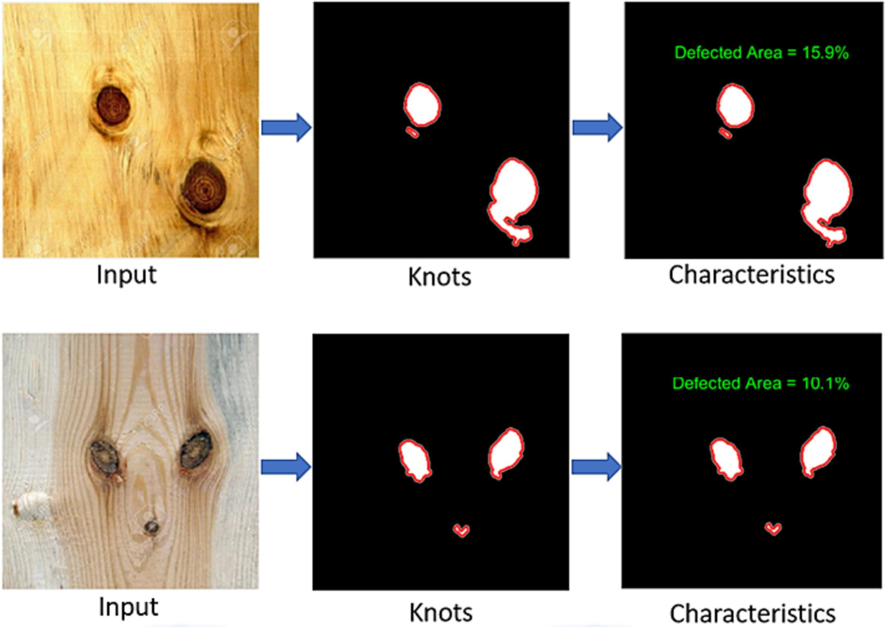
```
.center[.font80[**Fonte**: Ehtisham et al. (2024).]]
]

.pull-right-9[
<br><br>
.center[**Tarefa**: .green[Detecção]]

.center[.blue[Avaliação da qualidade da superfície da madeira serrada...]]

.font80[
- Cracks (**Rachaduras**)
- knots (**Nós**)
- Undamaged (**Sem danos**)
]
]

---
## 🔍 Aplicações de CNN nas Ciênciais Florestais
<br>
.pull-left-9[
```{r , echo=FALSE, fig.show='hold', out.width='70%', fig.align='center'}
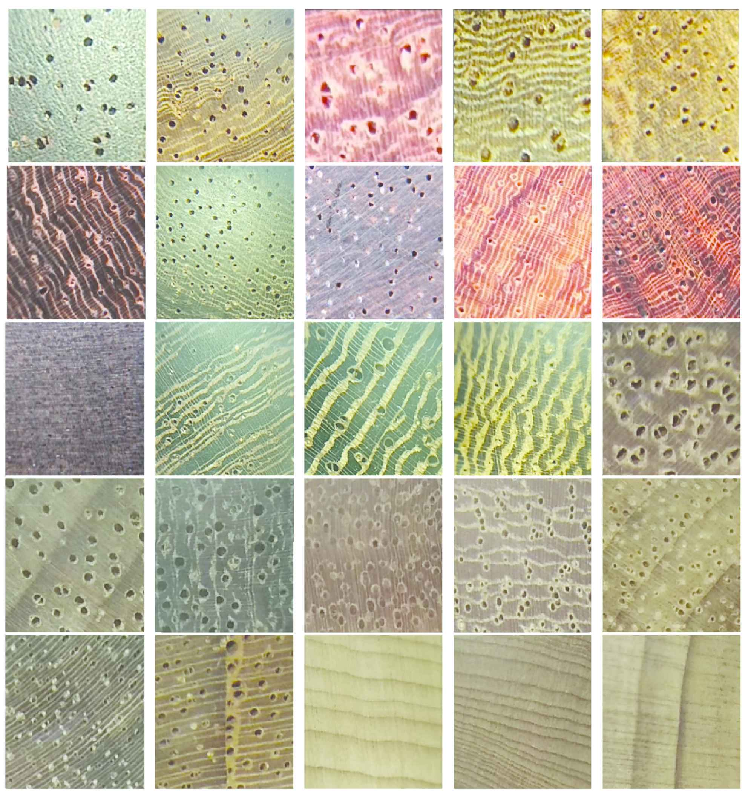
```
.center[.font80[**Fonte**: Sun et al. (2021).]]
]

.pull-right-9[
<br>
.center[**Tarefa**: .green[Classificação]]

.center[.blue[Classificação de espécies de madeira baseado em imagens macroscópicas...]]

.font80[
- Abordagem: ResNet50 
- Acurácia: 99,6%
- Número de Espécies: 25
- Origem: China
- Número de imagens: 3.000
]
]

---
## 🔍 Aplicações de CNN nas Ciênciais Florestais
<br>
.pull-left-3[
```{r , echo=FALSE, fig.show='hold', out.width='100%', fig.align='center'}
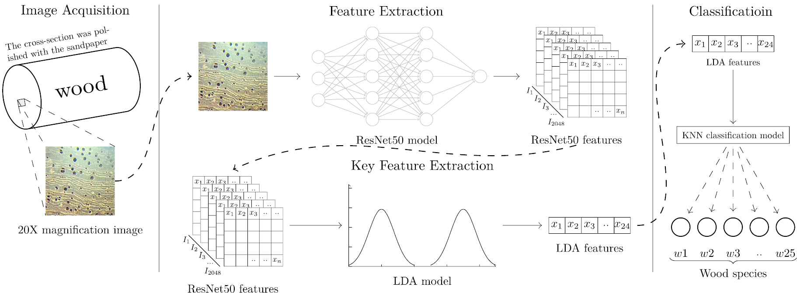
```
.center[.font80[**Fonte**: Sun et al. (2021).]]
]

.pull-right-3[
<br>
.center[**Tarefa**: .green[Classificação]]

.center[.blue[Classificação de espécies de madeira baseado em imagens macroscópicas...]]

.font80[
- Abordagem: ResNet50 
- Acurácia: 99,6%
- Número de Espécies: 25
- Origem: China
- Número de imagens: 3.000
]
]

---
## 🔍 Aplicações de CNN nas Ciênciais Florestais

# Imagens Micro

---
## 🔍 Aplicações de CNN nas Ciênciais Florestais

# Imagens Casca (Gama)


<!-- Slide XX -->
---
class: inverse
layout: false
background-image: url(fig/deepflora.png), url(fig/sec.png)
background-position: 99% 90%
background-size: 350px, cover

## .font90[**Projeto DeepFlora: <br> Inteligência Artificial para Reconhecer <br> Árvores da Amazônia**]
### *(DeepFlora: Artificial Intelligence to Recognize Amazonian Trees)*

---
layout: true
background-image: url(fig/deepflora.png), url(fig/cont.png)
background-position: 99% 99%
background-size: 400px, cover
---
## 🖥️Projeto DeepFlora

.shadow1[
#### 🔍 **Projeto de Pesquisa, Desenvolvimento e Inovação Florestal**

👉 **Objetivo**: Desenvolver um **sistema de reconhecimento automático de espécies florestais** de valor comercial madeireiro, usando **imagens digitais de partes de árvores** (cascas externa (ritidoma), alburno e forma da base de troncos) e técnicas de **aprendizado profundo** (*Deep Learning*), visando a **melhoria da acurácia na identificação de espécies** da flora Amazônica no âmbito Manejo Florestal Sustentável para fins madeireiros.

]

<br>

.shadow3[Desenvolver um **sistema baseado em IA e Visão Computacional** que possa servir como **ferramenta auxiliar na identificação de árvores** no MFS para fins de exploração madeireira
]


---
## 🏫 Instituições Parceiras e Financiador

.pull-left-11[
.pull-left-11[
```{r ufpa, echo=FALSE, fig.show='hold', out.width='70%', fig.align='center'}

```
]

.pull-right-11[
```{r ufrrj, echo=FALSE, fig.show='hold', out.width='70%', fig.align='center'}

```
]

.pull-bottom[
.pull-left-11[
<br><br>
```{r ufpr, echo=FALSE, fig.show='hold', out.width='80%', fig.align='center'}

```
]

.pull-right-11[
```{r ufra, echo=FALSE, fig.show='hold', out.width='70%', fig.align='center'}

```
]
]
]

## .center[💰 Financiador]
.pull-right-11[
```{r cipem, echo=FALSE, fig.show='hold', out.width='50%', fig.align='center'}

```
]

---
layout: true
background-image: url(fig/deepflora.png), url(fig/cont.png)
background-position: 3% 95%
background-size: 400px, cover
---
## 🤔 Motivação

.pull-left-5[
<br><br>
.brand-red[.center[**Por que desenvolver um sistema de reconhecimento automático de espécies da flora?**]]
]

--

.pull-right-5[
```{r, echo=FALSE, out.width='85%', fig.align='center', fig.cap=''}
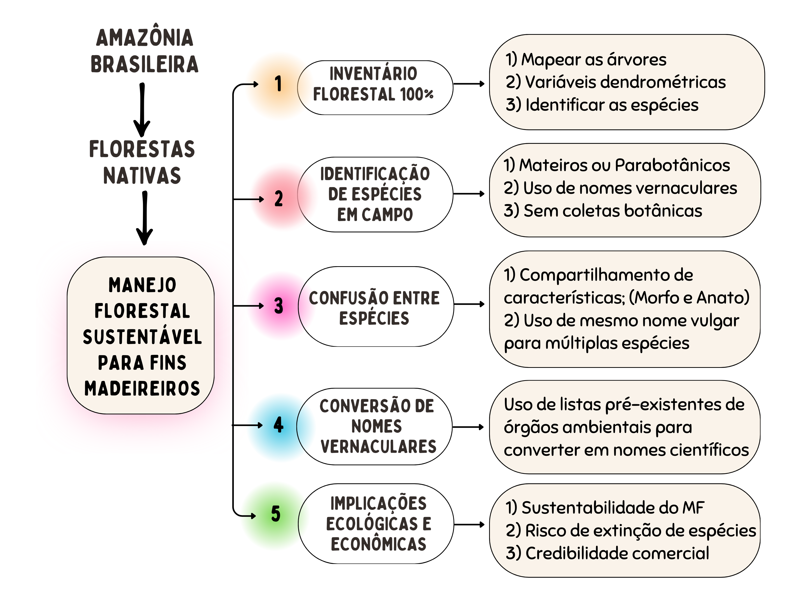
```
.center[.font80[**Fonte**: O autor (2025).]]
]

---
## 🤔 Motivação

.pull-left-5[
<br><br>
.brand-red[.center[**Estudos reportaram altas taxas de erros de identificação de espécies em PMFS na Amazônia brasileira...**]]
]

--

.pull-right-5[
```{r, echo=FALSE, out.width='90%', fig.align='center', fig.cap=''}
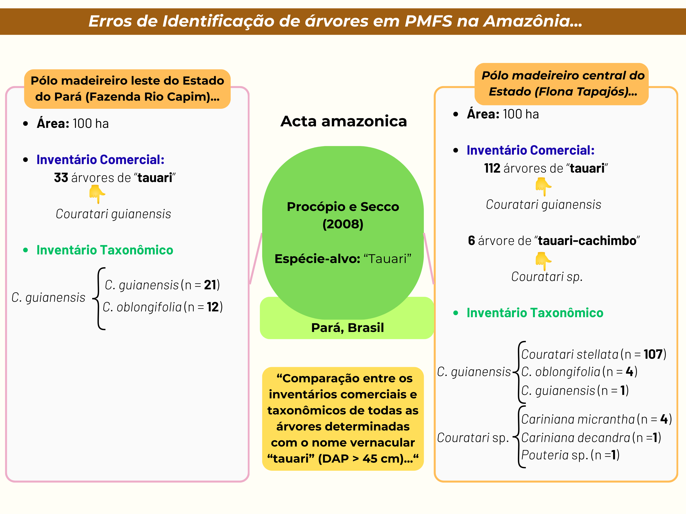
```
.center[.font80[**Fonte**: O autor (2025).]]
]

---
## 🤔 Motivação


.pull-left-5[
<br><br>
.brand-red[.center[**Estudos reportaram altas taxas de erros de identificação de espécies em PMFS na Amazônia brasileira...**]]
]

--

.pull-right-5[
```{r, echo=FALSE, out.width='95%', fig.align='center', fig.cap=''}
knitr::include_graphics('fig/research2.png')
```
.center[.font80[**Fonte**: O autor (2025).]]
]

---
layout: true
background-image: url(fig/deepflora.png), url(fig/cont.png)
background-position: 99% 99%
background-size: 400px, cover
---
## 🤔 Motivação

.shadow1[
👉 **Instrução Normativa 28, de 11 de dezembro de 2024/IBAMA**
.font80[
Estabelece os procedimentos relativos às atividades de **Manejo Florestal Sustentável das espécies** listadas no **Anexo II** da Convenção sobre o Comércio Internacional das Espécies da Flora e Fauna Selvagens em Perigo de Extinção - **CITES**, dos gêneros .blue[*Handroanthus, Tabebuia, Dipteryx e Cedrela*], por recomendação do Parecer de Extração Não Prejudicial; e as regras de transição para autorização de exportação de produtos e subprodutos madeireiros desses gêneros oriundos de florestas nativas do bioma amazônico. 
]
]

<br>

.pull-left-4[
.font80[
| Gênero         | FOA/FE/S/C |     | FOD |     |
|--------------  |------------|-----|-----|-----|
|                | DMC        | IME | DMC | IME |
| *Handroanthus* | 60         | 70  | 70  | 70  |
| *Tabebuia*     | 60         | 70  | 70  | 70  |
| *Dipteryx*     | 60         | 75  | 80  | 75  |
| *Cedrela*      | 55         | 70  | 70  | 50  |
.center[.font80[**Fonte**: O autor (2025).]]
<br>
.font70[Acesse aqui: [Instrução Normativa 28, de 11 de dezembro de 2024/IBAMA](https://www.ibama.gov.br/component/legislacao/?view=legislacao&legislacao=139446)]
]
]

.pull-right-4[
.font80[
FOA = Floresta Ombrófila Aberta/FE = Floresta Estacional/S = Savana/C = Campinarana

FOD = Floresta Ombrófila Densa

DMC = Diâmetro Mínimo de Corte, em cm

IME = Intensidade Máxima de Exploração, em %
]
]

---
layout: true
background-image: url(fig/deepflora.png), url(fig/cont.png)
background-position: 3% 95%
background-size: 400px, cover
---
## 🤔 Motivação

.pull-left-5[
<br><br>
.brand-red[.center[**Art. 12.** A identificação das espécies descritas deverá ser realizada no âmbito do POA, utilizando uma das metodologias a seguir:]
]
]

--

.pull-right-5[
```{r, echo=FALSE, out.width='85%', fig.align='center', fig.cap=''}
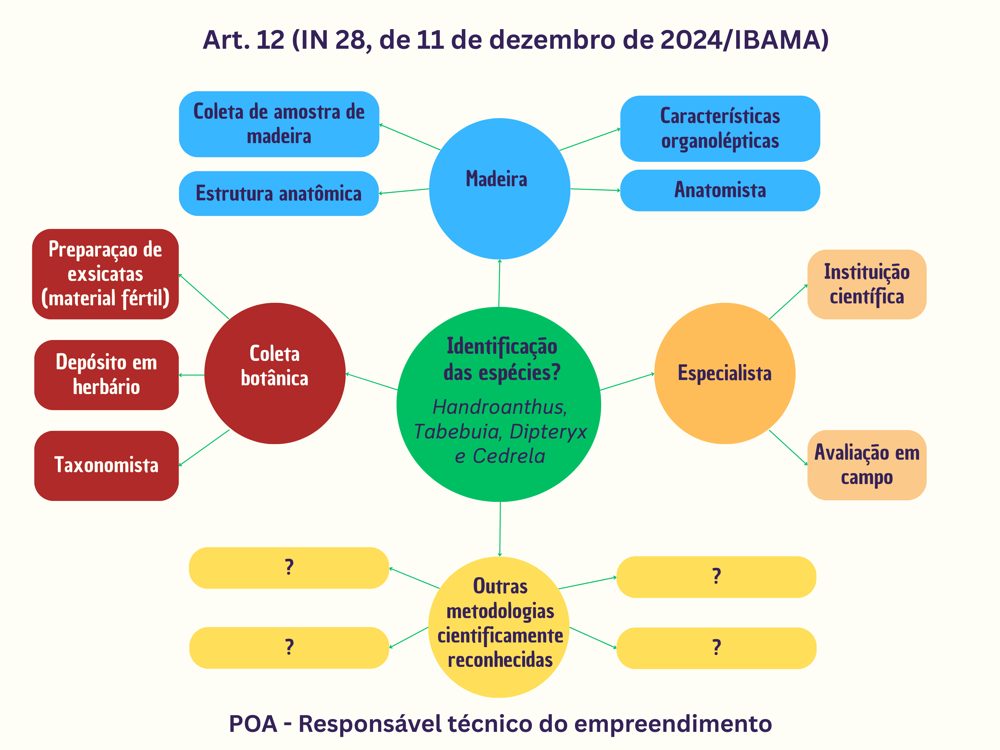
```
.center[.font80[**Fonte**: O autor (2025)]]
]

---
## 🌳 Sistemas Automáticos: Quais possibilidades?

```{r, echo=FALSE, out.width='70%', fig.align='center', fig.cap=''}
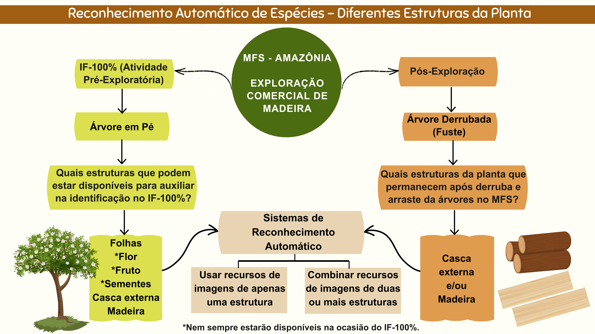
```
.center[.font80[**Fonte**: O autor (2025).]]

---
layout: true
background-image: url(fig/deepflora.png), url(fig/cont.png)
background-position: 99% 99%
background-size: 400px, cover
---
## 🌎 Áreas de Coletas

```{r, echo=FALSE, out.width='58%', fig.align='center', fig.cap=''}
knitr::include_graphics('fig/map.png')
```
.center[.font80[**Fonte**: Gama et al. (2025).]]

---
## Variáveis coletadas

.pull-left-9[
.shadow1[
#### 📝 **Variáveis coletadas**
]

.shadow4[
- Imagens da planta: Casca externa, alburno e forma da base do tronco
- Coordenadas Geográficas
- Diâmetro a 1,30 m do solo
- Altura (clinômetro Haglof)
- Espessura da casca
- Escalada de árvores para coleta de material botânico
]
]

.pull-right-9[
```{r, echo=FALSE, out.width='90%', fig.align='center', fig.cap=''}
knitr::include_graphics('fig/mosaico.png')
```
.center[.font80[**Fonte**: Acervo do autor (2025).]]
]

---
layout: true
background-image: url(fig/deepflora2.png), url(fig/cont.png)
background-position: 100% 50%
background-size: 200px, cover
---
## 🌳 Imagens de Partes da Planta

.pull-left-15[
.pull-left-17[
```{r, echo=FALSE, out.width='75%', fig.align='center', fig.cap=''}
knitr::include_graphics('fig/parkia.png')
```
]

.pull-left-17[
```{r, echo=FALSE, out.width='75%', fig.align='center', fig.cap=''}
knitr::include_graphics('fig/sima.png')
```
]
.center[.font80[**Fonte**: Acervo do autor (2025).]]
]

---
## 🍃 Identificação de Espécies
<br>

```{r, echo=FALSE, out.width='60%', fig.align='center', fig.cap=''}
knitr::include_graphics('fig/bot.png')
```
.center[.font80[**Fonte**: Acervo do autor (2025).]]
<br>

.center[.font80[**Coletas botânicas**: .blue[83 espécimes de 16 espécies (no mínimo 5 árvores por espécie)]]]

---
## 🍃 Identificação de Espécies
<br>

```{r, echo=FALSE, out.width='65%', fig.align='center', fig.cap=''}
knitr::include_graphics('fig/press.png')
```
.center[.font80[**Fonte**: Acervo do autor (2025).]]

.font80[.center[.blue[Exsicatas foram enviadas e incorporadas ao Herbário Felisberto Camargo (HFC) <br> da Universidade Federal Rural da Amazônia....]]]

---
## 🍃 Rotulação de imagens

.pull-left-10[
#### .center[🤔 Importância da identificação de espécies para a correta rotulação de imagens]

.font80[
👉 **Rotulação de imagens**: Processo de anotar e classificar o conteúdo de imagens para, posteriormente, treinar modelos baseados em técnicas de visão computacional.]
<br>

.center[.blue[A qualidade da rotulação de imagens afeta diretamente a acurácia do modelo!]]

]

.pull-right-10[
```{r, echo=FALSE, out.width='55%', fig.align='center', fig.cap=''}
knitr::include_graphics('fig/comp.png')
knitr::include_graphics('fig/comp2.png')
```
.center[.font80[**Fonte**: Acervo do autor (2025).]]
]

---
layout: true
background-image: url(fig/deepflora.png), url(fig/cont.png)
background-position: 99% 99%
background-size: 400px, cover
---
## 📷 Amazon Bark Dataset

.pull-left-9[
.shadow1[
#### **Amazon Bark Dataset**
]

.shadow4[
- Denominação: **Amazon Bark** (Cascas Externas)
- Sítios: **3 Áreas de Manejo Florestal**
- Número de imagens: **2.803 imagens**
- Número de Gêneros/Espécies/Família: **16/16/9**
- Número de árvores por espécie: **10**
- Dois dispositivos:

1) **Câmera Canon EOS Rebel** (3024 x 4032 pixels) 

2) **iPhone 11** (4000 x 5328 pixels)

- Distância de captura: 20 cm a 40 cm do tronco
- Altura de captura: 0,30 m a 1,40 m do solo
]
]

.pull-right-9[
<br><br><br>
```{r, echo=FALSE, out.width='100%', fig.align='center', fig.cap=''}
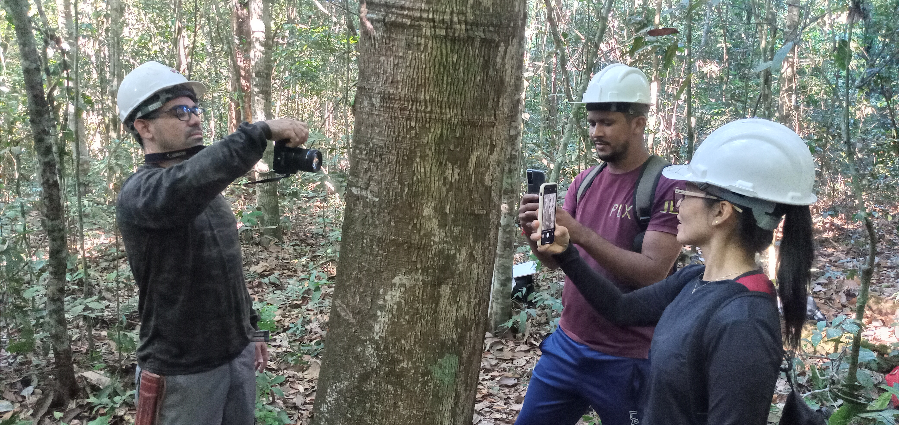
```
.center[.font80[**Fonte**: Acervo do autor (2025).]]
]

---
## 📷 Amazon Bark Dataset
<br>

```{r, echo=FALSE, out.width='65%', fig.align='center', fig.cap=''}
knitr::include_graphics('fig/treebark.png')
```
.center[.font80[**Fonte**: Gama et al., 2025]]

---
layout: true
background-image: url(fig/deepflora2.png), url(fig/cont.png)
background-position: 98% 50%
background-size: 200px, cover
---
## 📷 Amazon Bark Dataset

.pull-left-11[
```{r, echo=FALSE, out.width='79%', fig.align='center', fig.cap=''}
knitr::include_graphics('fig/bark.jpg')
```
]

.pull-left-11[
```{r, echo=FALSE, out.width='75%', fig.align='center', fig.cap=''}
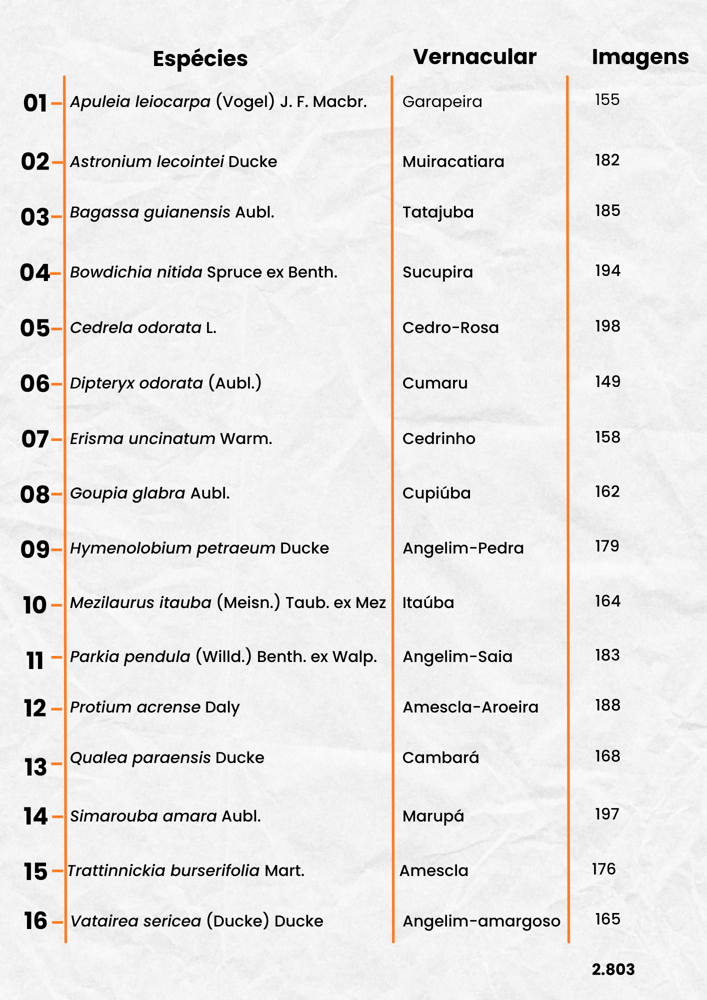
```
]

---
layout: true
background-image: url(fig/deepflora.png), url(fig/cont.png)
background-position: 99% 99%
background-size: 400px, cover
---
## 🌳 DeepBark - Aplicação Web

.shadow1[
#### **DeepBark: Reconhecendo Árvores Comerciais a partir de Imagens da Casca**

.shadow80[
.font80[
- **Nome**: .blue[**Deep**] (*Deep Learning*) e .blue[**Bark**] (*Casca*)
- **Aplicação Web**: Sistema baseado em .blue[visão computacional e aprendizado profundo] (*deep learning*) para reconhecer .blue[16 espécies] da flora Amazônica de valor comercial madeireiro, baseado em .blue[imagens digitais de cascas externas] (ritidoma) de árvores.
- **Modelo de Reconhecimento**: .orange[Natally Celestino Gama] (Dissertação de Mestrado/PPGBC/UFPA)
- **Acesse aqui**: [Dissertação de Mestrado](chrome-extension://efaidnbmnnnibpcajpcglclefindmkaj/https://ppgbc.propesp.ufpa.br/ARQUIVOS/dissertacoes/2024/Natally_Celestino_07.06.24.pdf)
<br>
]
]
]

---
layout: true
background-image: url(fig/deepflora2.png), url(fig/cont.png)
background-position: 100% 50%
background-size: 200px, cover
---
## 👩‍🔬 Publicação científica

.pull-left-16[
```{r, echo=FALSE, out.width='80%', fig.align='center', fig.cap=''}
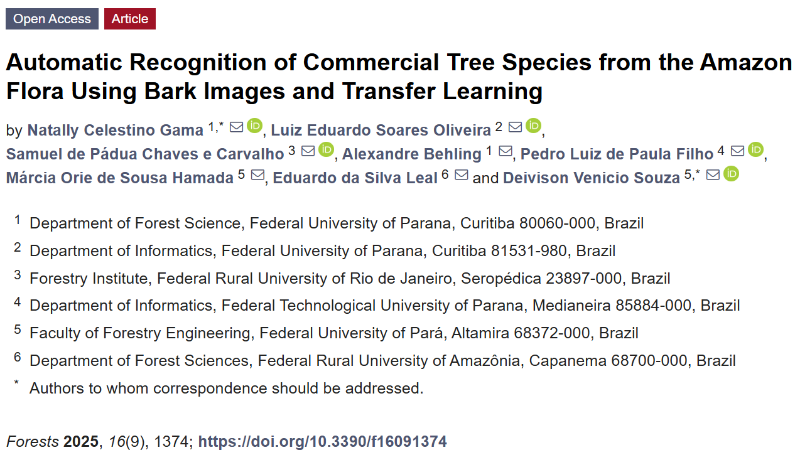
```

.center[.font80[**Acesse aqui**: [Gama et al., 2025](https://doi.org/10.3390/f16091374)]]
]

---
## 🌳 DeepBark - Aplicação Web (Modelo)

.pull-left-16[
```{r, echo=FALSE, out.width='80%', fig.align='center', fig.cap=''}
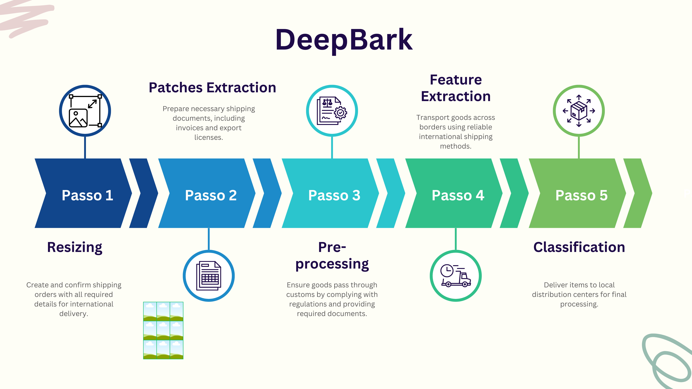
```
.center[.font80[**Fonte**: O autor (2025).]]
.center[.font80[**Acurácia**: .blue[95%] (de cada 100 imagens acerta 95)]]
]

---
## 🌳 DeepBark - Aplicação Web (Interface)

.pull-left-16[
```{r, echo=FALSE, out.width='90%', fig.align='center', fig.cap=''}
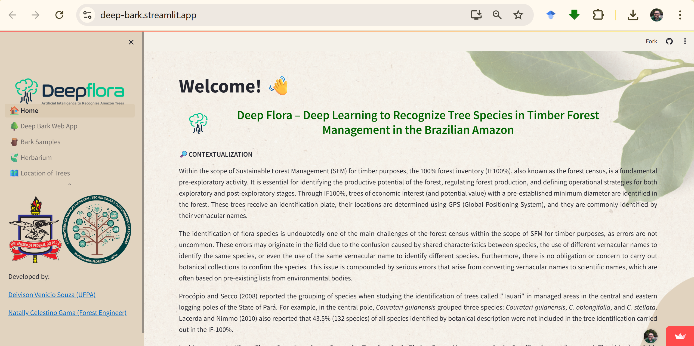
```
.center[.font80[**Fonte**: O autor (2025).]]
]

---
## 🌳 DeepBark - Aplicação Web (Funcionamento)

.center[
<iframe width="760" height="515" src="https://www.youtube.com/embed/a6-HWc7GDJw?si=9zpwC3DdqiFdghzn" title="YouTube video player" frameborder="0" allow="accelerometer; autoplay; clipboard-write; encrypted-media; gyroscope; picture-in-picture; web-share" referrerpolicy="strict-origin-when-cross-origin" allowfullscreen></iframe>
]
.center[.font80[**Fonte**: O autor (2025).]]

---
## 🌳 DeepBark - Aplicação Web (Considerações finais)

.pull-left-16[
```{r, echo=FALSE, out.width='90%', fig.align='center', fig.cap=''}
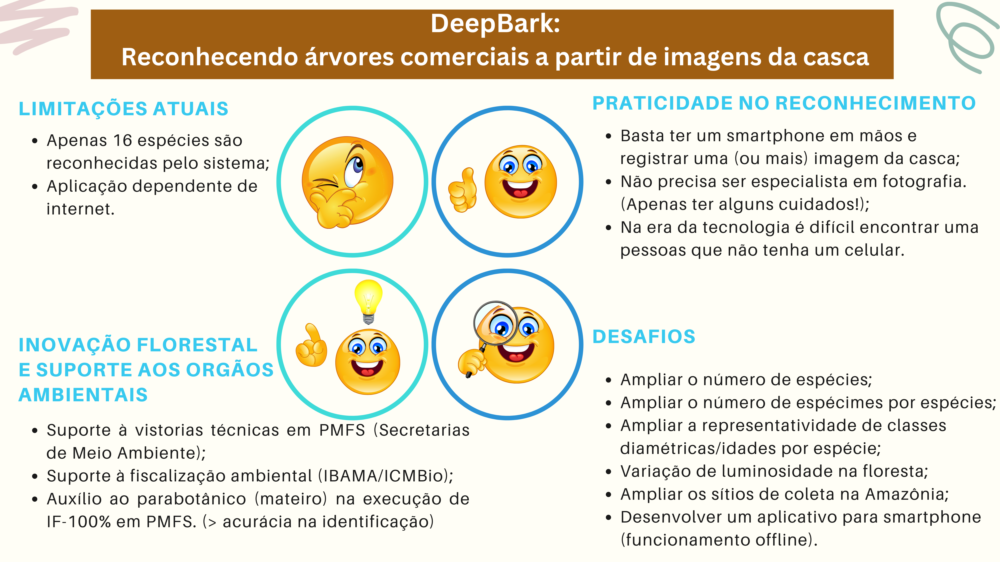
```
.center[.font80[**Fonte**: O autor (2025).]]
]

---
## 📖 Referências

.pull-left-16[
.font80[
<br>
LACERDA, A. E. B.; NIMMO, E. R. Can we really manage tropical forests without knowing the species within? getting back to the basics of forest management through taxonomy. Forest Ecology and Management, Elsevier, v. 259, n. 5, p. 995–1002, 2010.
<br><br>
PROCÓPIO, L. C.; SECCO, R. S. A importância da identificação botânica nos inventários florestais: o exemplo do "tauari" (*Couratari* spp. e *Cariniana* spp.- Lecythidaceae) em duas áreas manejadas no estado do Pará. Acta amazônica, v. 38, p. 31-44, 2008.
<br><br>
GAMA, N. C. **Reconhecimento automático de espécies florestais amazônicas a partir de imagens de cascas baseado em padrões binários locais e aprendizado profundo**. 2024. Dissertação (Mestrado em Biodiversidade e Conservação) – Universidade Federal do Pará, Altamira, 2024. Disponível em: [Link](chrome-extension://efaidnbmnnnibpcajpcglclefindmkaj/https://ppgbc.propesp.ufpa.br/ARQUIVOS/dissertacoes/2024/Natally_Celestino_07.06.24.pdf). Acesso em: 25 ago. 2025. 
]
]

---

layout: false
name: etim
class: inverse, middle, center
background-image: url(fig/title.jpg)
background-size: cover

## .font200[Obrigado!]

```{r, echo=FALSE, out.width='20%', fig.align='center', fig.cap='', dpi=600}
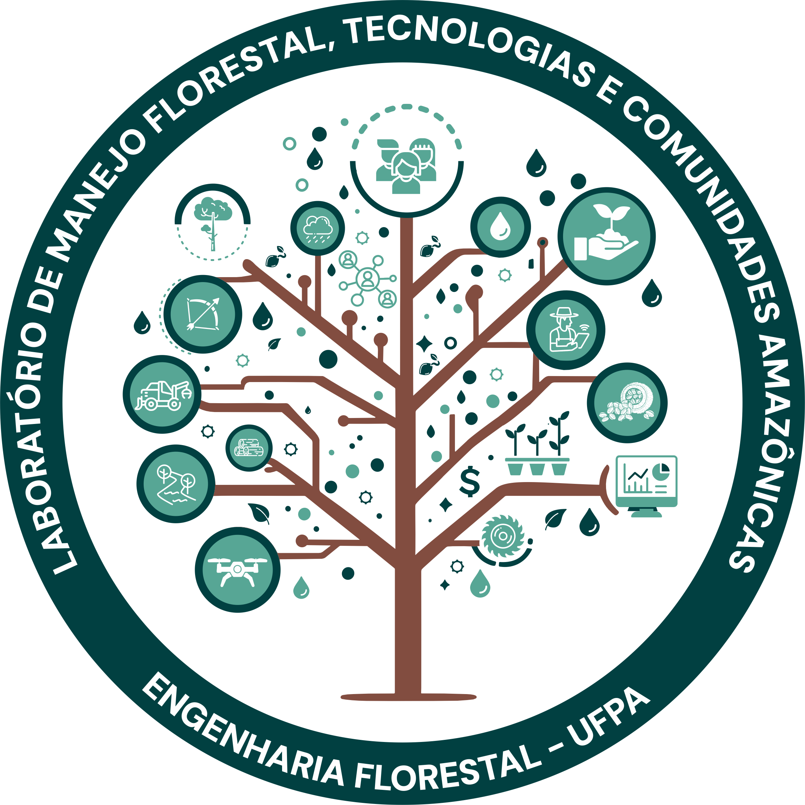
```

👨🏻‍👩🏻‍👦🏻‍👦🏻 [@lmftca_ufpa](https://www.instagram.com/lmftca_ufpa/)

🌎 [https://www.lmftca.com.br/](https://www.lmftca.com.br/)


